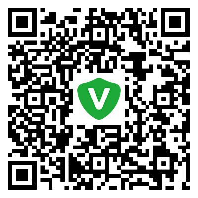

# Velock Sync

**Language / 语言 / Sprache / Idioma / Langue / 言語 / 언어 / Taal / Język / Язык / Lingua / Dil / Ngôn ngữ / Bahasa / भाषा / اللغة:**
[English](README.md) · [简体中文](README.zh-CN.md) · [繁體中文](README.zh-TW.md) · [Deutsch](README.de.md) · [Español](README.es.md) · [Français](README.fr.md) · [हिन्दी](README.hi.md) · [Bahasa Indonesia](README.id.md) · [Italiano](README.it.md) · [日本語](README.ja.md) · [한국어](README.ko.md) · [Nederlands](README.nl.md) · [Polski](README.pl.md) · [Português](README.pt.md) · [Русский](README.ru.md) · [Türkçe](README.tr.md) · [Tiếng Việt](README.vi.md) · [العربية](README.ar.md)

---

Velock Sync è uno strumento di sincronizzazione bidirezionale incrementale, open source e multipiattaforma. Per gli utenti di Velock, è l’app complementare autonoma che sincronizza i dati cifrati del tuo vault tra i tuoi dispositivi. Supporta anche la sincronizzazione di cartelle scelte dall’utente con crittografia end-to-end, senza richiedere un account Velock.

## Caratteristiche principali

- Sincronizzazione bidirezionale incrementale: vengono trasferiti solo contenuti nuovi o modificati; con ripristino da checkpoint, caricamenti riprendibili e garbage collection; i dati esistenti non vengono ricaricati.
- Crittografia end-to-end: in modalità Velock vengono spostati solo delta cifrati opachi generati da Velock. Velock Sync non possiede mai la chiave master né le chiavi di sincronizzazione di Velock e non legge il suo database.
- Sincronizzazione cartelle generiche: gli utenti non Velock possono scegliere una cartella locale, cifrata end-to-end per impostazione predefinita, con una modalità mirror semplice.
- Più destinazioni cloud: supportati WebDAV, Google Drive e OneDrive; altri servizi come Baidu Netdisk e Aliyun Drive arrivano tramite adattatori Provider.
- Collaborazione multi-dispositivo: i vettori di versione e i tombstone garantiscono che le modifiche simultanee non vadano mai perse silenziosamente; in caso di conflitto vengono conservate entrambe le versioni e scegli tu.
- Sincronizzazione in background: attivazione manuale, in primo piano e al ripristino della rete, oltre a Android WorkManager / iOS BGTask.
- Multipiattaforma: mobile-first (iOS/iPadOS, Android); il desktop verrà migliorato gradualmente.

## Piattaforme

- Dati gestiti da Velock V1: iOS/iPadOS, con scambio tramite un App Group dedicato.
- Cartelle scelte e provider cloud: Android e iOS/iPadOS.
- Desktop: previsto.

## Open source e nota commerciale

**Open source**

Velock Sync è completamente open source con licenza Apache-2.0. Chiunque può controllare il nucleo di sincronizzazione, compilarlo dal sorgente o contribuire con nuove fonti di dati e provider cloud.

**Nota commerciale**

Il progetto è gestito da Chongqing Win Data Technology Co., Ltd. L’open source e l’attività commerciale di Velock sono indipendenti: puoi sempre compilare dal sorgente, auto-ospitare o usare versioni dai canali ufficiali. Usare Velock Sync non richiede un account Velock e non ti vincola a nessun servizio cloud specifico.

## Velock è disponibile sull’App Store

  

oppure

  

