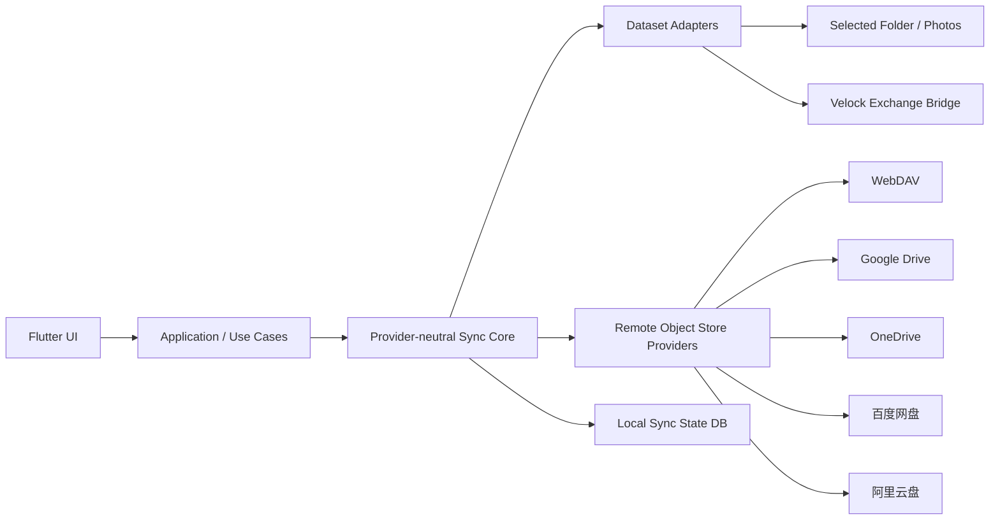
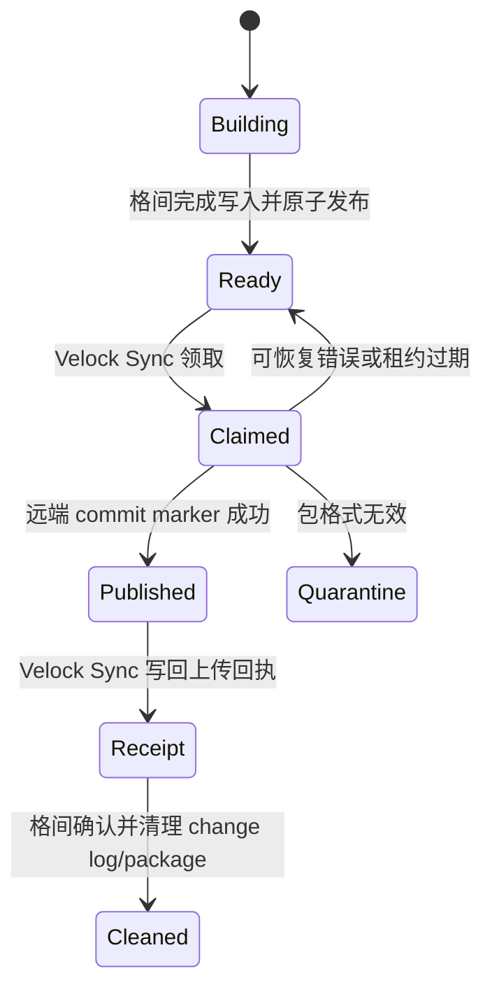
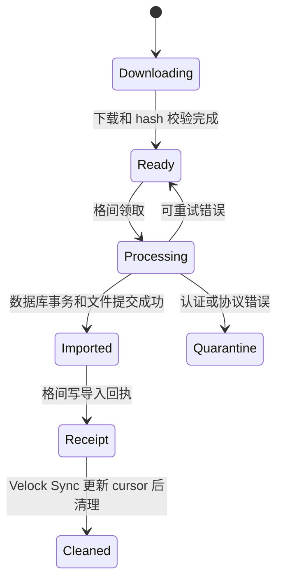
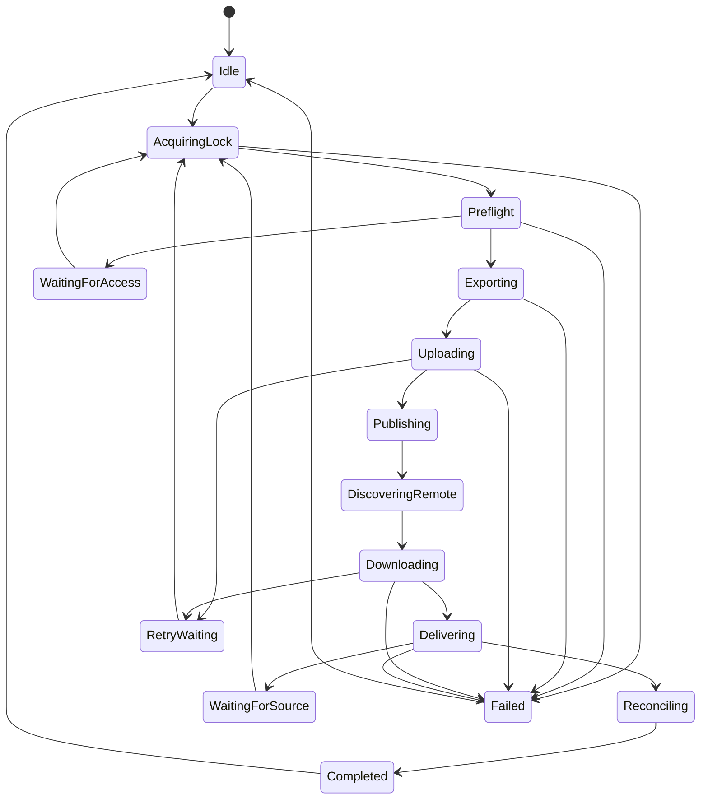

# Velock Sync 技术规格（Technical Specification）

- 文档版本：0.1
- 协议版本：Velock Sync Protocol V1
- 状态：Draft
- 更新日期：2026-07-14
- 适用仓库：
  - `/Users/parcool/AndroidStudioProjects/velock_sync`
  - `/Users/parcool/AndroidStudioProjects/velock_codex`
- 产品需求：[`PRD.md`](./PRD.md)
- 协议定义：[`SYNC_PROTOCOL_V1.md`](./SYNC_PROTOCOL_V1.md)

平台实现边界：Velock managed data 的 V1 生产链路以 iOS/iPadOS 的专用
Exchange App Group 为准；Android Velock ContentProvider 是冻结协议下的未来
兼容实现，不进入当前首发运行矩阵。Selected Folder 与远端 Provider 继续采用
Android/iOS 共用 Sync Core，并分别实现平台授权与后台调度。

## 1. 目的

本文档把 PRD 转换为可实施的工程规格，定义：

- 系统边界；
- 模块职责；
- 信任模型；
- 数据模型；
- 数据源与 Provider 接口；
- 增量双向同步算法；
- 格间交换通道；
- 本地状态存储；
- 安全、错误处理、后台执行和测试要求；
- 从当前 WebDAV 原型迁移到目标架构的步骤。

文档中的关键词含义：

- **MUST / 必须**：协议或安全正确性的硬性要求；
- **SHOULD / 应该**：无特殊理由应遵循；
- **MAY / 可以**：可选优化。

## 2. 当前代码基线

### 2.1 Velock Sync

当前仓库已经存在：

- Flutter + Riverpod + Freezed 基础；
- `ConnectionModel` 和 `ProtocolModel.webDav`；
- SharedPreferences 连接持久化；
- WebDAV `ping`、目录浏览和文件下载；
- `SyncTask` 展示模型；
- Dashboard、Connections、Settings 路由框架。

关键现状：

- `ProtocolModel.webDav` 当前包含 `username` 和 `password`；
- `ConnectionModel` 会整体 JSON 序列化，因此凭证可能进入普通偏好设置；
- `lib/sync/http.dart` 尚不是同步引擎；
- 不存在本地同步数据库、变更日志、上传器、冲突处理和后台调度。

### 2.2 格间

格间当前：

- 使用 `group.tech.windata.velock` 与扩展共享文件；
- App Group 中存在 `File/`、`Media/`、`Document/`、`Credential/`、`Pending/`、`Manifests/` 等目录；
- SQLite 数据库 `venyoreDb` 位于格间私有 Documents，而不是 App Group；
- 业务元数据位于 SQLite，不能只同步加密文件目录；
- 已存在 Share Extension 通过 `Pending + Manifests` 交付文件、格间负责导入的模式；
- 当前共享 UserDefaults 中使用过 `shared_final_key` 和 `shared_sandbox_id`。

因此 Velock Sync 不得直接镜像格间实时目录，也不得加入格间现有内部 App Group。

## 3. 架构目标

系统由四个边界组成：



### 3.1 核心依赖规则

- UI 可以依赖 Application；
- Application 可以依赖 Sync Core 接口；
- Sync Core 不得依赖 Flutter Widget；
- Sync Core 不得依赖任何具体 Provider SDK；
- Provider 不得直接访问数据源目录；
- Dataset Adapter 不得直接调用具体 Provider；
- 格间业务解析只能发生在格间主 App；
- 平台 App Group、ContentProvider、Document Picker 等能力必须位于 Platform Adapter。

## 4. 信任模型

### 4.1 信任区域

| 组件 | 格间模式下是否可信 | 可持有格间明文 | 可持有格间同步密钥 |
| --- | --- | --- | --- |
| 格间主 App | 是 | 是 | 是 |
| 格间必要扩展 | 受限可信 | 按功能最小化 | 按功能最小化 |
| Velock Sync | 否，按传输层处理 | 否 | 否 |
| 云端 Provider | 否 | 否 | 否 |
| App Group Exchange | 否，按共享介质处理 | 否 | 否 |

### 4.2 攻击假设

协议必须考虑：

- Velock Sync 进程被篡改；
- Provider SDK 或依赖被污染；
- 云端对象被删除、替换、回滚或乱序返回；
- 同一个批次被重复投递；
- 同步过程中 App 崩溃或系统杀进程；
- 两台设备长时间离线后同时修改；
- 恶意包声明超大大小、非法路径或未知操作；
- 用户撤销目录或 OAuth 权限。

协议不保证在云端账号完全被控制时的可用性，但必须保证格间数据的机密性和导入完整性。

## 5. 建议代码组织

### 5.1 Velock Sync

目标目录：

```text
lib/
├── app/
│   ├── routing/
│   └── bootstrap/
├── application/
│   ├── connections/
│   ├── profiles/
│   ├── sync_runs/
│   └── conflicts/
├── sync_core/
│   ├── model/
│   ├── engine/
│   ├── scheduler/
│   ├── transfer/
│   ├── conflict/
│   ├── crypto/
│   └── contracts/
├── datasets/
│   ├── velock/
│   ├── selected_folder/
│   └── photo_library/
├── providers/
│   ├── webdav/
│   ├── google_drive/
│   ├── onedrive/
│   ├── baidu_netdisk/
│   └── aliyun_drive/
├── infrastructure/
│   ├── database/
│   ├── secure_storage/
│   ├── networking/
│   └── logging/
└── features/
    ├── dashboard/
    ├── connections/
    ├── profiles/
    ├── activity/
    ├── conflicts/
    └── settings/
```

可以分阶段迁移，不要求一次移动所有现有文件。

### 5.2 格间

建议新增：

```text
lib/sync/
├── model/
├── repository/
├── exporter/
├── importer/
├── conflict/
├── crypto/
└── bridge/

ios/Runner/SyncExchange/
├── SyncExchangePaths.swift
├── SyncExchangeFileCoordinator.swift
└── SyncExchangeBridge.swift

macos/Runner/SyncExchange/
└── ...
```

Android 后续新增：

```text
android/app/src/main/.../sync/
├── VelockSyncProvider.kt
├── SyncPermission.kt
└── SyncBridge.kt
```

## 6. 核心领域模型

### 6.1 Dataset

```dart
enum DatasetKind {
  velockManaged,
  selectedFolder,
  photoLibrary,
}

class DatasetDescriptor {
  final String datasetId;       // 本机记录 ID
  final String vaultId;         // 跨设备稳定 ID
  final DatasetKind kind;
  final String displayName;
  final DatasetAccessState accessState;
  final EncryptionMode encryptionMode;
}
```

V1 规则：

- 一个普通根目录对应一个 Dataset；
- 一个格间安全空间（sandbox）对应一个 Velock Dataset；
- 多个格间安全空间使用多个 Sync Profile；
- `vaultId` 使用随机 UUID，不使用用户 ID、邮箱或路径派生。

### 6.2 Remote Target

```dart
class RemoteTarget {
  final String targetId;
  final RemoteProviderType providerType;
  final String displayName;
  final String credentialRef;
  final String providerRootRef;
  final RemoteCapabilities capabilities;
  final RemoteLayoutMode layoutMode;
}
```

`credentialRef` 只引用平台安全存储，不包含密码或 Token。

`RemoteLayoutMode`：

- `managedVault`：使用本协议定义的不透明 batch/blob 布局，支持格间和通用端到端加密；
- `visibleMirror`：远端保留用户可见目录和文件名，并使用保留的 `.velock-sync/` 目录保存版本、tombstone 和设备状态。

V1 最小实现必须支持 `managedVault`。`visibleMirror` 属于产品可选能力，只有完成跨 Provider 路径、大小写、非法字符、重命名和 sidecar 恢复测试后才能开放。

### 6.3 Sync Profile

```dart
class SyncProfile {
  final String profileId;
  final String datasetId;
  final String targetId;
  final String vaultId;
  final SyncDirection direction;
  final SyncPolicy policy;
  final SyncProfileState state;
  final DateTime createdAt;
  final DateTime updatedAt;
}
```

V1 必须支持 `bidirectional`。接口保留 `uploadOnly` 和 `downloadOnly`，但产品是否开放由后续决定。

### 6.4 Device Identity

每个安装实例生成：

```text
deviceId       随机 UUID
signingKeyPair 设备签名密钥对
createdAt
friendlyName
platform
appInstanceId
```

规则：

- `deviceId` 不得从硬件序列号派生；
- 删除 App 后重新安装默认生成新设备；
- 格间模式签名私钥由格间保存；
- 通用加密模式签名私钥由 Velock Sync 保存；
- 私钥必须进入平台安全存储。

### 6.5 Version Vector

每个实体维护版本向量：

```json
{
  "device-a": 12,
  "device-b": 4
}
```

比较规则：

- A 每个分量均大于等于 B，且至少一个更大：A 支配 B；
- 所有分量相同：重复版本；
- A 和 B 互不支配：并发冲突。

本地修改时：

1. 读取当前向量；
2. 当前设备分量加一；
3. 生成新 revision；
4. 在同一事务中写业务变化和 change log。

### 6.6 Operation

数据源内部操作模型：

```dart
enum SyncOperationType {
  upsert,
  delete,
  resolveConflict,
}

class SyncOperation {
  final String operationId;
  final String entityId;
  final String entityKind;
  final SyncOperationType type;
  final Map<String, int> versionVector;
  final String revisionId;
  final String? previousRevisionId;
  final Uint8List protectedPayload;
  final List<String> blobIds;
  final DateTime createdAt;
}
```

对于 Velock Dataset，`protectedPayload` 由格间生成并加密，Velock Sync 不解析。

### 6.7 Blob

```dart
class BlobDescriptor {
  final String blobId;
  final int cipherSize;
  final String cipherSha256;
  final String mediaType; // 默认 application/octet-stream
  final int chunkSize;
}
```

规则：

- 远端 blob 内容不可变；
- `blobId` 不包含原文件名；
- V1 使用随机不透明 `blobId`，内容完整性由独立 `cipherSha256` 字段验证；
- 同一个 `blobId` 已存在时不重复上传；
- 不采用跨 Vault 的明文内容寻址或收敛加密；
- 重命名和移动只产生元数据 operation，不产生新 blob。

## 7. Dataset Adapter 接口

```dart
abstract interface class SyncDatasetAdapter {
  Future<DatasetDescriptor> describe();

  Future<DatasetAccessState> checkAccess();

  Future<PreparedBaselinePage> prepareBaseline({
    required BaselineCursor? cursor,
    required BatchLimits limits,
  });

  Future<PreparedOutgoingBatch?> prepareNextBatch({
    required ExportCursor cursor,
    required BatchLimits limits,
  });

  Future<void> acknowledgePublishedBatch({
    required String batchId,
    required DeviceSequence sequence,
  });

  Future<ImportResult> acceptIncomingBatch(
    IncomingBatch batch,
  ); // 返回可选的已签名 ack artifact

  Future<List<DatasetConflict>> listConflicts();
}
```

### 7.1 接口约束

- `prepareNextBatch` 必须可重入；
- 同一个 cursor 重试必须返回同一个逻辑批次，或返回能被识别为等价的批次；
- `acceptIncomingBatch` 必须幂等；
- Dataset Adapter 不得直接访问 Provider；
- Dataset Adapter 返回的 blob 必须可以流式读取；
- Velock Dataset Adapter 不得获得格间解密密钥。

## 8. Velock Dataset Adapter

Velock Adapter 位于 Velock Sync，但只负责交换通道，不负责业务序列化。

### 8.1 Apple 平台

使用新的 App Group：

```text
group.tech.windata.velock.sync.exchange
```

建议目录：

```text
SyncExchange/
├── Outbox/
│   ├── Ready/
│   ├── Claimed/
│   └── Receipts/
├── Inbox/
│   ├── Staging/
│   ├── Ready/
│   └── Receipts/
├── State/
└── Quarantine/
```

不得在该容器中保存：

- `shared_final_key`；
- 格间主密钥；
- 格间同步密钥；
- `venyoreDb`；
- 解密文件；
- Provider Token；
- WebDAV 密码。

客户端通过原生 `exchangeRoot` 通道只获取
`group.tech.windata.velock.sync.exchange/SyncExchange`；Dart 层以该目录创建
`VelockExchangeStore`，不得接收或推导其他格间容器路径。

### 8.2 Outbox 生命周期



规则：

1. 格间必须先写 `<batchId>.tmp`；
2. 写完并同步文件后，原子重命名至 `Ready/<batchId>`；
3. Velock Sync 不读取 `.tmp`；
4. 领取时原子移动至 `Claimed/<batchId>`，并写 lease；
5. 远端 batch 和 blobs 完成后最后发布 commit marker；
6. Velock Sync 写 receipt；
7. 格间确认 receipt 后才能删除对应本地 change log；
8. 崩溃后 lease 超时的 Claimed 包可恢复。

### 8.3 Inbox 生命周期



下载中间文件不得出现在 `Ready`。

格间导入成功后，导入回执必须包含由格间生成的已签名 ack artifact。Velock Sync 只负责把该 artifact 上传到远端，不获得格间设备签名私钥，也不得自行构造格间 ack。

### 8.4 Android 平台

本节定义未来 Velock Android 主 App 出现时的兼容边界，不是当前
iOS-first Velock V1 的首发依赖。

Android 不使用 App Group。格间主 App 应提供：

- signature protection level 的自定义权限；
- 只允许同签名 Velock Sync 调用的 ContentProvider 或 bound service；
- 通过 `ParcelFileDescriptor` 流式交付包和 blob；
- 明确的 claim、ack、reject API；
- 调用方包名和签名校验；
- 不暴露格间实时数据库和实时业务目录。

建议逻辑接口：

```text
queryReadyOutbox()
openOutboxEnvelope(batchId)
openOutboxBlob(batchId, blobId)
claimOutbox(batchId, leaseId)
acknowledgeOutbox(batchId, remoteCommit)
createInbox(batchId)
writeInboxBlob(batchId, blobId)
commitInbox(batchId)
queryInboxReceipt(batchId)
```

## 9. 格间侧同步存储

### 9.1 不直接同步 SQLite 文件

禁止：

- 上传运行中的 `venyoreDb`；
- 下载后覆盖 `venyoreDb`；
- 将数据库复制到共享 App Group 作为同步源。

原因：

- 数据库与业务文件不是单一原子事务；
- 不同设备自增 ID 会冲突；
- 版本迁移不可控；
- 无法正确表达删除和并发修改；
- 文档等内容部分直接位于数据库中。

### 9.2 推荐映射表

为减少对现有业务表的侵入，使用独立同步映射表，而不是立即为所有表添加 UUID 字段。

```sql
CREATE TABLE t_sync_entity (
  entity_uuid TEXT PRIMARY KEY,
  entity_type TEXT NOT NULL,
  local_table TEXT NOT NULL,
  local_id INTEGER,
  sandbox_id INTEGER NOT NULL,
  version_vector_json TEXT NOT NULL,
  current_revision_id TEXT,
  deleted_at INTEGER,
  created_at INTEGER NOT NULL,
  updated_at INTEGER NOT NULL,
  UNIQUE(local_table, local_id, sandbox_id)
);
```

### 9.3 本地变更日志

```sql
CREATE TABLE t_sync_change_log (
  local_sequence INTEGER PRIMARY KEY AUTOINCREMENT,
  operation_id TEXT NOT NULL UNIQUE,
  entity_uuid TEXT NOT NULL,
  entity_type TEXT NOT NULL,
  operation_type TEXT NOT NULL,
  revision_id TEXT NOT NULL,
  version_vector_json TEXT NOT NULL,
  protected_payload BLOB NOT NULL,
  blob_refs_json TEXT NOT NULL,
  batch_id TEXT,
  export_state TEXT NOT NULL,
  created_at INTEGER NOT NULL,
  published_at INTEGER,
  FOREIGN KEY(entity_uuid) REFERENCES t_sync_entity(entity_uuid)
);
```

`export_state`：

```text
pending -> packaged -> published -> acknowledged
```

### 9.4 已应用操作

```sql
CREATE TABLE t_sync_applied_operation (
  operation_id TEXT PRIMARY KEY,
  source_device_id TEXT NOT NULL,
  source_sequence INTEGER NOT NULL,
  applied_at INTEGER NOT NULL,
  result TEXT NOT NULL
);
```

用于保证重复投递幂等。

### 9.5 冲突记录

```sql
CREATE TABLE t_sync_conflict (
  conflict_id TEXT PRIMARY KEY,
  entity_uuid TEXT NOT NULL,
  local_revision_id TEXT NOT NULL,
  incoming_revision_id TEXT NOT NULL,
  conflict_type TEXT NOT NULL,
  protected_details BLOB,
  status TEXT NOT NULL,
  created_at INTEGER NOT NULL,
  resolved_at INTEGER
);
```

### 9.6 业务事务要求

所有同步相关业务写入必须满足：

```text
业务表修改
+ t_sync_entity 版本更新
+ t_sync_change_log 追加
```

在同一个 SQLite 事务内完成。

如果操作包含新文件：

1. 先将加密文件写入正式目录的临时名称；
2. 完成 fsync/hash；
3. SQLite 事务写入业务记录和变更日志；
4. 原子发布正式文件名；
5. 启动恢复逻辑清理由崩溃产生的孤儿临时文件或补齐未发布文件。

### 9.7 格间对象范围

V1 至少覆盖：

- 文件及目录层级；
- Media 记录；
- Document 记录及数据库内内容；
- Password；
- Card；
- Note；
- 相关标签和关联关系；
- 必要的 sandbox 配置。

以下默认不跨设备同步，除非产品另行确认：

- 最近使用记录；
- 查看次数；
- 临时解密状态；
- 设备本地路径；
- 临时文件；
- UI 窗口状态；
- 缓存和缩略图；
- 仅对当前设备有意义的设置。

## 10. 普通文件夹 Dataset

### 10.1 本地索引

Velock Sync 为每个目录 Dataset 维护：

```sql
CREATE TABLE local_entry (
  dataset_id TEXT NOT NULL,
  entity_id TEXT NOT NULL,
  relative_path TEXT NOT NULL,
  entry_type TEXT NOT NULL,
  size INTEGER,
  modified_at INTEGER,
  file_identity TEXT,
  content_hash TEXT,
  blob_id TEXT,
  version_vector_json TEXT NOT NULL,
  scan_generation INTEGER NOT NULL,
  deleted_at INTEGER,
  PRIMARY KEY(dataset_id, entity_id),
  UNIQUE(dataset_id, relative_path)
);
```

### 10.2 路径规则

- 内部路径使用 `/`；
- 必须是相对路径；
- 禁止空路径段、`.` 和 `..`；
- 文件名采用 Unicode NFC 规范化参与比较；
- 保留用户可见名称，但检测不同平台的大小写冲突；
- V1 不跟随符号链接；
- 禁止访问授权根目录之外的路径；
- 排除同步引擎自己的临时目录。

### 10.3 扫描算法

1. 验证根目录授权；
2. 增加 `scanGeneration`；
3. 分页枚举目录；
4. 使用路径、大小、mtime 和平台 file identity 快速判断；
5. 可疑变化进入后台 full hash；
6. 新文件分配随机 `entityId`；
7. 同一轮扫描内可用 file identity 或内容 hash 辅助识别重命名；
8. 完整扫描成功后处理未出现条目；
9. 扫描中断或根目录不可访问时不得产生删除；
10. 生成 operation 和 blob。

### 10.4 大规模删除保护

满足任一条件时暂停删除发布：

- 单次删除超过 1000 个条目；
- 删除数量超过上次完整扫描条目数的 20%；
- 根目录身份变化；
- 授权刚恢复且目录内容异常为空；
- Provider 或本地文件系统返回不完整列表。

用户确认或后续完整扫描恢复正常后再继续。

### 10.5 冲突文件命名

默认格式：

```text
<原名>（冲突 - <设备名> - <yyyyMMdd-HHmmss>）.<扩展名>
```

必须处理目标文件名长度、非法字符和大小写冲突。

## 11. Remote Object Store 接口

```dart
abstract interface class RemoteObjectStore {
  RemoteCapabilities get capabilities;

  Future<RemoteObjectMetadata?> stat(String logicalKey);

  Stream<RemoteObjectMetadata> list({
    required String logicalPrefix,
  });

  Future<RemotePutResult> put({
    required String logicalKey,
    required Stream<List<int>> content,
    required int contentLength,
    required String contentSha256,
    PutCondition condition = const PutCondition.none(),
    TransferCheckpoint? checkpoint,
  });

  Stream<List<int>> get({
    required String logicalKey,
    int? startOffset,
  });

  Future<void> delete(String logicalKey);

  Future<bool> healthCheck();
}
```

### 11.1 Provider 规则

- Provider 只接收逻辑 key 和字节流；
- Provider 不得自行枚举 Dataset；
- Provider 不得读取其他 Provider 的凭证；
- Provider 文件 ID、drive ID、fs_id 等只存于 Provider 私有映射；
- Provider 必须对 401、403、404、409、412、429 和 5xx 分类；
- 所有重试必须有指数退避和随机抖动；
- Provider 必须支持取消；
- 日志不得打印 Authorization header、Cookie、密码或完整 Token。

### 11.2 RemoteCapabilities

```dart
class RemoteCapabilities {
  final bool supportsConditionalCreate;
  final bool supportsConditionalUpdate;
  final bool supportsRangeDownload;
  final bool supportsResumableUpload;
  final bool supportsServerHash;
  final bool supportsTrash;
  final bool supportsHiddenAppFolder;
  final bool hasStrongListConsistency;
  final int? maxSingleRequestBytes;
  final int? recommendedChunkBytes;
}
```

Sync Core 必须根据能力选择策略，不得假设所有 Provider 支持原子 rename、ETag 或相同 hash 算法。

### 11.3 Visible Mirror 扩展

当 `layoutMode = visibleMirror` 时，远端结构为：

```text
<用户选择的远端目录>/
├── <原始文件和目录>
└── .velock-sync/
    ├── protocol.json
    ├── entities/
    ├── tombstones/
    └── devices/
```

要求：

- 文件内容和名称对 Provider 可见，不属于端到端加密模式；
- `.velock-sync/` 是协议保留目录，不得作为用户文件同步；
- Provider 必须实现路径字符转义和反向映射；
- 大小写不敏感目标发现同名冲突时不得静默覆盖；
- sidecar 丢失时进入恢复/重建流程，不得把远端缺失直接解释为批量删除；
- 格间 Dataset 禁止使用 `visibleMirror`；
- V1 首次实现可以不开放该模式，但模型和 UI 不得把它与 `managedVault` 混淆。

## 12. Provider 实现要求

### 12.1 WebDAV

- 默认要求 HTTPS；
- HTTP 仅在用户明确确认后允许；
- 支持 Basic/Digest/服务端兼容认证按实际库能力实现；
- 支持 PROPFIND、GET、PUT、DELETE、MKCOL；
- 可用时使用 ETag 和 Range；
- 服务器不支持可恢复上传时，应用层按不可变对象重试；
- 路径必须进行 RFC 合法编码，不能直接拼接未经处理的用户输入。

### 12.2 OAuth Provider

Google Drive、OneDrive、百度网盘和阿里云盘必须：

- 使用系统浏览器授权；
- 原生/移动客户端使用 PKCE 或 Provider 官方等价安全流程；
- 不把服务端 client secret 编译进 App；
- 使用最小权限 scope；
- Refresh Token 进入平台安全存储；
- 支持授权撤销和重新登录；
- Provider API 规则变化时通过适配器处理，不修改同步协议。

如某 Provider 必须通过机密 client secret 换取 Token，则使用独立、最小权限的官方 Token Broker，或在无法满足安全要求时暂缓上线。

### 12.3 Provider 契约测试

每个 Provider 必须通过同一组测试：

- 写入并读取零字节对象；
- 写入并读取小对象；
- 大对象流式上传；
- 中断后恢复或安全重试；
- 重复 put 的幂等行为；
- list 分页完整性；
- 404 分类；
- 401 后刷新凭证；
- 429 退避；
- hash 验证；
- Unicode logical key；
- 删除或移入回收站；
- 网络取消；
- Provider 限额错误映射。

## 13. 本地状态数据库

Velock Sync 必须从 SharedPreferences 任务元数据迁移到 SQLite。推荐使用 Drift；如果使用其他 SQLite 封装，也必须保留相同事务和迁移能力。

### 13.1 表范围

```text
connections
provider_credentials_ref
remote_targets
datasets
sync_profiles
devices
sync_cursors
sync_runs
transfer_jobs
remote_objects
incoming_batches
outgoing_batches
conflicts
scan_entries
schema_migrations
```

### 13.2 Connection 凭证迁移

当前 `ProtocolModel.webDav` 中的：

```text
username
password
```

目标模型改为：

```text
username（可保存为非秘密显示字段）
credentialRef
```

迁移过程：

1. 读取旧 Connection JSON；
2. 将密码写入 Keychain/Keystore；
3. 获得 `credentialRef`；
4. 事务性写入新数据库；
5. 重写或删除旧 JSON 中的密码；
6. 如果安全存储写入失败，不删除旧记录并要求用户重新输入；
7. 任何日志都不得输出旧密码。

### 13.3 Transfer Job

```dart
enum TransferJobState {
  queued,
  running,
  paused,
  retryWaiting,
  completed,
  failed,
  cancelled,
}
```

每个 job 保存：

- `transferId`；
- `profileId`；
- `direction`；
- `logicalKey`；
- `expectedSize`；
- `expectedHash`；
- `completedBytes`；
- Provider checkpoint；
- retry count；
- next retry time；
- sanitized error code。

## 14. 同步运行状态机



### 14.1 单实例锁

同一个 `profileId` 同时只能有一个活动 Sync Run。锁必须：

- 持久化；
- 包含 owner、创建时间和 heartbeat；
- 崩溃后可回收；
- 不使用进程内 bool 作为唯一锁。

### 14.2 预检

同步前检查：

- Dataset 授权；
- Provider 凭证；
- 网络策略；
- 远端 Vault 身份；
- 本地磁盘空间；
- 协议版本；
- 是否存在未处理冲突或大规模删除保护；
- 是否已有需要恢复的 transfer job。

## 15. 增量双向算法

### 15.1 上传

1. 获取 profile 锁；
2. Dataset Adapter 根据本地 export cursor 准备批次；
3. 对每个 blob 执行远端 `stat`；
4. 不存在则上传；
5. 上传 batch body；
6. 校验远端对象元数据；
7. 最后发布不可变 commit marker；
8. 更新本地 published cursor；
9. 通知 Dataset Adapter batch 已发布；
10. 继续下一批，直到达到本次运行预算。

### 15.2 下载

1. 列出其他设备的 commit marker；
2. 按 `sourceDeviceId + sequence` 排序；
3. 跳过已应用 sequence；
4. 下载 batch body；
5. 下载缺失 blob；
6. 校验大小和 ciphertext hash；
7. 交给 Dataset Adapter；
8. Dataset Adapter 完成认证、解密、版本比较和导入；
9. 写 applied cursor；
10. 获取 Dataset Adapter 返回的已签名 ack artifact，并原样发布。格间模式下 ack 必须由格间签名，Velock Sync 不得代签。

### 15.3 乱序

- 不要求不同设备之间存在全局顺序；
- 同一源设备 sequence 必须按顺序应用；
- 缺少前序批次时等待，不直接跳过；
- 其他设备的批次可以并行下载，但导入由 Dataset Adapter 串行或按实体安全并发。

### 15.4 幂等

幂等键：

```text
vaultId + sourceDeviceId + sourceSequence + batchId
```

operation 幂等键：

```text
operationId
```

远端 blob 幂等键：

```text
blobId
```

### 15.5 删除

删除 operation 包含：

- `entityId`；
- 新 version vector；
- deletion timestamp；
- 可选 previous revision；
- 不包含文件明文路径。

删除后保留 tombstone，直到满足 GC 条件。

### 15.6 冲突

版本比较：

| 比较结果 | 行为 |
| --- | --- |
| incoming 支配 local | 应用 incoming |
| local 支配 incoming | 忽略 incoming，但记录已处理 |
| 相等 | 幂等跳过 |
| 并发 | 创建冲突 |

普通文件：

- 内容冲突保留两份；
- 删除与修改冲突默认保留修改副本并保留删除冲突记录；
- 目录移动冲突使用确定性设备 ID 排序选主位置，另一个位置记录冲突。

格间结构化对象：

- Velock Sync 不执行合并；
- 格间根据对象类型处理；
- 无安全的自动合并规则时保留两个 revision；
- 用户解决冲突后生成支配双方版本向量的新 operation。

## 16. 基线和 Checkpoint

### 16.1 初始基线

远端为空时：

- 数据源分页枚举当前状态；
- 每页形成正常 batch；
- 上传成功后清理本地 staging；
- 不生成整个数据集的完整副本；
- 基线结束后发布 `baselineComplete` marker。

### 16.2 Checkpoint

Checkpoint 用于新设备快速加入和压缩历史，不是每次同步的完整备份。

生成条件可以是：

- operation 数量超过阈值；
- 距上次 checkpoint 超过指定时间；
- 用户手动优化；
- 移除设备或协议迁移。

Checkpoint 必须：

- 具有独立 ID；
- 分页或分片；
- 包含生成时的各设备已知 cursor；
- 完成后最后发布 commit marker；
- 未完成 checkpoint 不可见。

## 17. 远端垃圾回收

V1 可以只标记、不立即删除。正式 GC 必须满足：

1. 所有活动设备已 ack 对应 operation；
2. operation 已被某个有效 checkpoint 覆盖；
3. tombstone 超过保留期；
4. blob 不再被任何活动 revision 或 checkpoint 引用；
5. 删除计划先写入 GC manifest；
6. 支持 dry-run；
7. 删除后保留审计摘要。

设备移除必须由用户确认，并更新加密设备成员信息。

实现顺序必须是：先发布由仍受信任设备签名的 `revoked` member
artifact，再撤销本机下载信任；发布失败时不得撤销本机信任。密钥轮换和新
checkpoint 是单独的后续步骤，因为移除不能撤销已获得的历史明文能力。

## 18. 加密和密钥

具体 wire 格式见协议文档，本节定义实现边界。

### 18.1 密钥类型

```text
Vault Root Key
├── Metadata Encryption Key
├── Blob Key / Blob Wrapping Key
├── Identifier Key
└── Recovery / Membership Keys

Device Signing Key Pair
Provider OAuth/WebDAV Credentials（独立，不从 Vault Key 派生）
```

### 18.2 格间模式

- Vault Root Key 只在格间内；
- Velock Sync 不调用“解密格间包”接口；
- 格间生成 operations ciphertext 和签名；
- 格间导入时验证签名、Vault、sequence 和 AEAD；
- 交换目录中的任何内容都按不可信输入处理。

### 18.3 通用加密模式

- Vault Root Key 由 Velock Sync 生成；
- 存储于 Keychain/Keystore；
- 通过恢复码、口令派生包装或设备配对传递；
- 恢复材料不得自动上传为明文；
- 忘记密钥时官方不得承诺恢复。

### 18.4 普通镜像模式

- 不对内容做 E2EE；
- 同步状态和 Provider Token 仍必须安全存储；
- UI 和日志必须明确其隐私等级。

## 19. 批次和临时空间

### 19.1 默认限制

```text
maxOperationsPerBatch = 500
maxBatchCipherBytes = 256 MiB
maxConcurrentUploadsMobile = 3
maxConcurrentDownloadsMobile = 3
```

单个大于 256 MiB 的文件允许单独成为一个 batch，并必须流式传输。

### 19.2 Apple 文件克隆

格间向 Exchange 发布现有不可变加密文件时：

1. 优先尝试 APFS Copy-on-Write clone；
2. 失败后进行空间预检；
3. 使用流式 copy；
4. 上传并收到 receipt 后删除 Exchange 副本。

协议正确性不得依赖 clone 成功。

### 19.3 低空间行为

- 空间不足时暂停，不产生半成品 Ready 包；
- 清理过期 `.tmp`、失败下载和已确认 batch；
- 不自动删除尚未确认的 Outbox；
- 提供所需空间和当前可用空间提示。

## 20. 后台执行

平台适配：

```text
iOS/iPadOS：短任务使用 BGAppRefreshTask；大文件使用 BGProcessingTask / background URLSession（能力允许时）
Android：WorkManager + 前台服务（大文件且合规时）
macOS/Windows/Linux：系统任务或受控常驻调度
```

原则：

- 后台入口复用同一个 Sync Engine；
- UI 不在场时也必须依赖持久化状态；
- 系统取消后保存 checkpoint；
- 不保证精确执行时间；
- 用户关闭后台、蜂窝或电量条件时严格遵守。

当前实现使用一个静态声明的 iOS `BGAppRefreshTask` 标识符，集中处理所有
已启用后台同步的 profile；Android 使用网络、低电量及（当所有已启用配置均
要求时）充电约束的 WorkManager 周期任务。执行前会逐一复查网络和充电状态，
因此混合配置不会让“仅充电”的配置在电池供电时传输。profile 默认仅允许
Wi-Fi，且默认不要求充电；用户允许蜂窝网络时，默认把单次上传批次及单个
下载对象限制为 50 MiB（可选 10/50/100 MiB）。15 分钟是 Android 的最小请求
间隔，iOS 由系统决定实际触发时间。

## 21. 错误模型

```dart
enum SyncErrorCategory {
  transientNetwork,
  rateLimited,
  authenticationRequired,
  permissionRequired,
  remoteNotFound,
  remoteConflict,
  localAccessLost,
  insufficientSpace,
  integrityFailure,
  unsupportedProtocol,
  datasetRejected,
  userActionRequired,
  permanent,
}
```

每个错误包含：

- 稳定 `errorCode`；
- category；
- sanitized message；
- retryable；
- retryAfter；
- provider 原始状态码（无敏感内容）；
- runId/profileId/batchId/transferId；
- 用户操作建议。

不得直接把异常 `toString()` 全量上传到遥测服务。

## 22. 日志和遥测

### 22.1 允许记录

- runId、batchId、transferId；
- Provider 类型；
- 字节数；
- 时长；
- 标准化错误码；
- 重试次数；
- 匿名版本信息。

### 22.2 禁止记录

- 密码；
- Authorization header；
- Refresh Token；
- Vault Key；
- 签名私钥；
- 明文文件名和完整路径；
- 密码、卡片、笔记和文档内容；
- 未脱敏的 Provider 响应正文。

## 23. 开源与供应链安全

- 保持 Apache-2.0；
- 依赖版本进入 lockfile；
- CI 运行静态分析、测试、依赖许可和 secret scan；
- 官方构建不动态执行远端下载代码；
- Provider PR 需要代码所有者审核；
- 对密码学、App Group、OAuth 和文件导入代码设置更高审核要求；
- 发布包必须由官方签名；
- 建议生成 SBOM；
- 建议发布可验证的构建信息和校验值。

## 24. 测试策略

### 24.1 单元测试

- version vector 比较；
- operation 幂等；
- cursor 计算；
- tombstone；
- 冲突判定；
- 路径规范化；
- batch 分页；
- retry/backoff；
- 凭证脱敏。

### 24.2 Dataset 契约测试

所有 Dataset Adapter：

- 基线分页；
- 新增、修改、移动、重命名和删除；
- 重复 batch；
- 乱序；
- 冲突；
- 授权丢失；
- 崩溃恢复；
- 空间不足。

### 24.3 Provider 契约测试

使用统一 test suite；正式 Provider 可使用测试账号运行可选集成测试。

### 24.4 协议测试向量

仓库新增：

```text
test_vectors/protocol_v1/
├── valid/
├── invalid_authentication/
├── replay/
├── corrupted_blob/
├── unsupported_version/
└── path_traversal/
```

Dart、Swift 和 Kotlin 必须对同一向量产生一致结果。

### 24.5 故障注入

至少覆盖：

- 上传到 30% 断网；
- blob 成功但 batch 未成功；
- batch 成功但 commit marker 未成功；
- commit 成功但本地 cursor 未落库；
- 下载成功但格间未导入；
- 格间导入成功但 receipt 未写；
- Provider 返回重复或乱序列表；
- App 在每个状态转换点被杀死。

## 25. 迁移计划

### Milestone A：领域和持久化

- 新建 Sync Core contracts；
- 引入 SQLite 状态库；
- 迁移 Connection；
- 密码移入安全存储；
- 保留当前 UI，替换底层 repository。

### Milestone B：Provider 抽象

- 将现有 WebDAV 代码迁移为 `WebDavObjectStore`；
- 实现 Provider 契约测试；
- 增加流式上传和下载；
- 去除 UI 对 WebDAV client 的直接依赖。

### Milestone C：普通文件夹同步

- 系统目录选择；
- 本地索引和扫描器；
- operation、blob、tombstone；
- WebDAV 双向同步；
- 冲突副本。

### Milestone D：格间交换

- 新 App Group entitlement；
- 格间 exporter/importer；
- Velock Adapter；
- 加密批次和测试向量；
- WebDAV 端到端双向同步。

### Milestone E：云盘 Provider

- Google Drive；
- OneDrive；
- 百度网盘；
- 阿里云盘；
- OAuth、审核和能力矩阵。

### Milestone F：Checkpoint、GC 和后台

- checkpoint；
- ack；
- 远端 GC；
- 设备移除；
- 后台执行和通知。

## 26. Definition of Done

一个功能只有满足以下条件才算完成：

- 符合 PRD 对应验收标准；
- 不突破信任边界；
- 有单元测试或契约测试；
- 崩溃恢复路径明确；
- 日志经过敏感信息审查；
- 数据库有升级和回滚策略；
- 协议变化已更新版本和测试向量；
- Provider 限额和权限已文档化；
- Flutter analyze 和相关平台构建通过；
- 没有把密码、Token 或密钥写入普通持久化。

## 27. 已确定的关键决策

1. Velock Sync 完全可以开源；
2. 不加入格间现有内部 App Group；
3. 使用专用 Exchange App Group；
4. Velock Sync 不持有格间解密和同步密钥；
5. 不同步运行中的 SQLite 文件；
6. 从第一版采用增量双向协议；
7. 初始同步使用分页基线，而不是本地完整副本；
8. 远端使用不可变 batch、blob 和 commit marker；
9. 每个设备只写自己的远端命名空间；
10. 使用 tombstone 表达删除；
11. 使用 version vector 判断并发；
12. Provider 与 Dataset 两轴解耦；
13. 凭证使用平台安全存储；
14. 不允许运行时下载并执行未知 Provider 代码。
