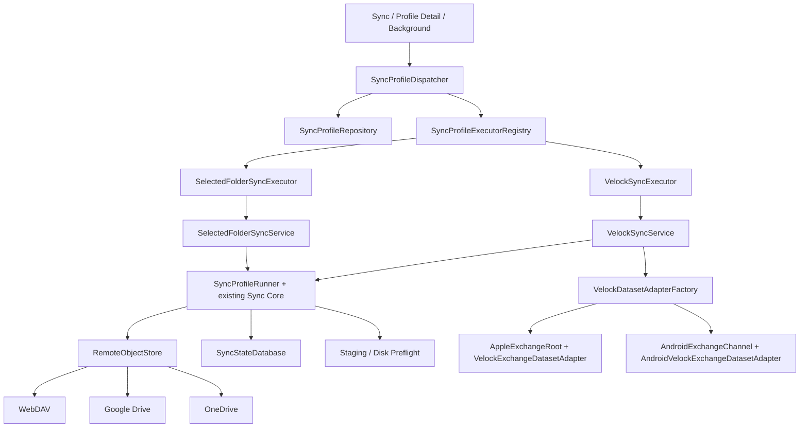

# Velock Sync V1 剩余工作完成规格（Completion SPEC）

- **文档状态**：Ready for implementation
- **版本**：1.0
- **日期**：2026-07-17
- **目标仓库**：`/Users/parcool/AndroidStudioProjects/velock_sync`
- **伴随仓库**：`/Users/parcool/AndroidStudioProjects/velock_codex`

平台范围冻结：Velock managed data 的 V1 发布与验收以 iOS/iPadOS 为主；
Android Velock bridge 仅保留未来兼容，不属于 V1 首发完成条件。Selected
Folder 与远端 Provider 等非 Velock 数据集仍按 Android/iOS 双平台验收。
- **目标读者**：负责完成 V1 剩余实现、测试和发布验收的编码模型与工程人员

> 本文是“剩余工作增量规格”，不是新的同步协议，也不替代已有 PRD、Technical Spec 或 Protocol V1。实现者必须保留已完成的 Sync Core，不得另起一套同步引擎。

---

## 1. 规范性来源与冲突处理

以下文档是规范性来源：

1. `docs/PRD.md`
2. `docs/TECHNICAL_SPEC.md`
3. `docs/SYNC_PROTOCOL_V1.md`

以下文档用于说明当前实现基线：

4. `docs/IMPLEMENTATION_STATUS.md`
5. `docs/ANDROID_VELOCK_EXCHANGE.md`
6. `docs/OAUTH_SETUP.md`
7. `docs/PROVIDER_ADMISSION.md`

冲突处理规则：

- Protocol V1 的对象格式、签名、哈希、路径、批次、commit、ack、checkpoint 和幂等语义，以 `docs/SYNC_PROTOCOL_V1.md` 为准。
- 产品范围、用户体验和 V1 发布验收，以 `docs/PRD.md` 为准。
- 架构、安全边界、Provider/Dataset 契约和 Definition of Done，以 `docs/TECHNICAL_SPEC.md` 为准。
- 本文只细化“尚未完成的工作”。若本文与前三份规范冲突，前三份规范优先。
- `docs/IMPLEMENTATION_STATUS.md` 只表示 2026-07-17 的实现快照，不能降低规范要求。

本文使用以下关键字：

- **MUST / 必须**：V1 发布不可缺少。
- **MUST NOT / 禁止**：违反即视为安全或协议缺陷。
- **SHOULD / 应当**：除非有记录充分的技术理由，否则必须实现。
- **MAY / 可以**：可选实现，不阻塞 V1。

---

## 2. 当前基线

### 2.1 已完成或基本完成的能力

实现者不得重复开发或替换以下能力，只能复用、补测试或修复明确缺陷：

- Protocol V1 的 immutable blob/batch/commit 发布与下载；
- version vector、tombstone、replay/idempotency、conflict copy；
- checkpoint、ack、多设备确认与远端 GC 基础能力；
- SQLite 同步状态、transfer jobs、sync runs、cursor；
- staging、磁盘空间 preflight、失败清理；
- Selected Folder / Generic Vault 的生产同步服务；
- WebDAV、Google Drive、OneDrive ObjectStore；
- OAuth PKCE、refresh、revocation 与安全凭据存储；
- foreground/background 调度基础能力；
- Generic Vault root key 与 device signing key 的安全存储；
- Velock Exchange 的 Apple/Android 低层 adapter、opaque package claim/delivery 和 receipt reconciliation 基础能力；
- Dart/iOS/Android Protocol V1 测试向量基础覆盖。

### 2.2 V1 尚未完成的范围

以下范围全部完成并有证据前，不得声称 V1 完成：

1. Velock Dataset 在本仓库中的生产级发现、授权、配对、Profile、运行与后台接入；
2. Velock Exchange Adapter 通过现有 Sync Core 与 WebDAV/GDrive/OneDrive 的真实远端传输；
3. 伴随仓库中 File/Media 的事务一致性，以及 Document 标签关系、sandbox 和双设备接入；
4. 统一 Sync Profile 列表、详情、设置和状态派发；
5. 冲突中心的真实解决语义，而不是只更新 `resolved_at`；
6. 全部 Provider 运行同一套 ObjectStore 契约；
7. WebDAV/GDrive/OneDrive 的契约缺口；
8. 百度网盘/阿里云盘的正式 Token Broker 决策与实现门禁；
9. Dataset 契约、双设备、故障注入和恢复测试；
10. Android/iOS 发布信任、签名和 Velock 互操作配置；
11. 完整 CI、发布证据和 PRD 14 项验收追踪。

---

## 3. V1 完成定义

只有同时满足以下条件，才能标记 V1 Complete：

- PRD 第 16 节的 14 项首版验收标准全部有“通过”证据；
- Velock 与 Selected Folder 都通过统一前台和后台 Profile 执行路径；
- Velock + WebDAV/GDrive/OneDrive 至少完成规定的双设备 E2E；
- Selected Folder + WebDAV/GDrive/OneDrive 至少完成规定的双设备 E2E；
- 所有已启用 Provider 通过统一 Provider Contract Suite；
- 所有已启用 Dataset Adapter 通过统一 Dataset Contract Suite；
- 故障注入、杀进程恢复、低磁盘、凭据丢失和授权撤销测试通过；
- Android 和 Apple 的 Exchange 信任配置在 Release 构建中 fail closed；
- 所有密钥、密码、Token、Velock 明文和签名种子均未进入普通数据库、Profile JSON、日志或测试产物；
- `flutter analyze`、`custom_lint`、`flutter test`、Android build/test、iOS build/test、license check、secret scan 全部通过；
- 百度/阿里若仍无官方 Broker，必须先正式修改 V1 支持矩阵和 PRD；未修改 PRD 时不能以“外部阻塞”为由宣称 V1 完成。

---

## 4. 范围分类

### 4.1 本仓库必须完成

- 通用 Profile envelope、repository、summary、executor registry 和 dispatcher；
- `VelockSyncProfile`、provisioner、discovery、authorization、pairing、service；
- Velock Profile 的 foreground/background 运行；
- 统一 Sync 首页、Profile wizard、Profile detail、Settings；
- Conflict Resolution domain service 和 UI；
- Provider Contract Suite 与现有 Provider 缺口；
- Dataset Contract Suite、fault injection、E2E harness；
- Release trust configuration 校验、CI 和验收证据模板。

### 4.2 伴随仓库必须完成

目标：`/Users/parcool/AndroidStudioProjects/velock_codex`

- File/Media 的 temp-file publication + 同一 SQLite transaction change log；
- Document 标签关系和 sandbox 配置；
- 所有 Velock V1 Dataset 的真实 Exchange export/import；
- ACK/receipt、cursor、重复/乱序/冲突和崩溃恢复；
- 双设备真实互操作测试。

伴随仓库未完成不得计入本仓库完成度。

### 4.3 外部阻塞项

- Android 正式 Velock package、ContentProvider authority、签名证书 SHA-256 digest、同签名 APK；
- Apple 正式 Exchange App Group entitlement、provisioning profile、签名构建；
- 百度/阿里官方 Token Broker endpoint、client id、scope、redirect、测试账号；
- 商店 Release signing assets；
- GitHub 组织真实 CODEOWNERS 用户或团队。

### 4.4 外部值缺失时的行为

- Release 构建必须 fail closed；
- Debug 构建只可使用明确标记的本地测试值；
- 禁止猜测 package、authority、证书摘要、App Group、Broker URL 或 client secret；
- 禁止将临时测试值作为 production 默认值提交；
- 实现者应完成可本地完成的代码、校验和测试，然后在外部阻塞点停止并输出缺失项清单。

### 4.5 非目标

- Protocol V2；
- 重写已完成的 Sync Core；
- Velock 业务明文内容合并；
- 任意文件格式自动合并；
- Sync App 获取 Velock master key、sync key 或旧私有容器权限；
- 在客户端内置百度/阿里 client secret；
- 精确时刻后台同步保证；
- 云盘间无本地直接搬运；
- 动态下载并执行 Provider 插件代码。

---

## 5. 不可破坏的架构和安全约束

### V1C-ARCH-001 — 单一 Sync Core

所有 Dataset 必须复用：

- `lib/sync_core/engine/sync_profile_runner.dart`
- 现有 upload/download/checkpoint/GC engines；
- `RemoteObjectStore`；
- `SyncStateDatabase`；
- staging 和 disk preflight。

禁止为 Velock 建立第二套远端协议、上传器、下载器、cursor 或 transfer job 状态机。

### V1C-ARCH-002 — Velock 零知识边界

Velock Sync：

- MUST NOT 读取 Velock master key、旧 App Group、业务 SQLite 或明文业务文件；
- MUST NOT 解密 Velock Exchange payload；
- MUST NOT 为 Velock 伪造或签署 ACK；
- MUST 只处理 envelope、ciphertext、signature、hash、sequence 和 receipt 等 opaque artifacts；
- MUST 只在 Velock 可信 receipt 确认导入后推进 incoming cursor；
- MUST 拒绝 malformed、unknown producer、unauthorized producer、bad signature/hash、sequence fork 和 unsupported version。

### V1C-ARCH-003 — 密钥和凭据

下列值不得出现在 Profile JSON、普通 SQLite 字段、SharedPreferences、日志或 crash metadata：

- WebDAV password；
- OAuth access/refresh token；
- Generic Vault root key；
- Ed25519 private/signing seed；
- Velock master/sync key；
- Token Broker secret；
- Release signing secret。

Profile 只能保存 secure-storage reference，例如 `rootKeyRef`、`signingKeyRef`、`credentialRef`。

### V1C-ARCH-004 — 不可变远端对象

所有 batch/blob/commit/member/ack/checkpoint 对象必须继续遵守 Protocol V1 immutable/idempotent 语义。Provider 缺少原生 resumable upload 时，必须通过不可变对象安全重试，不得覆盖不一致内容。

### V1C-ARCH-005 — 迁移兼容

- 现有 Selected Folder profiles 必须无损升级；
- 迁移不得要求用户重新选择文件夹、重新输入凭据或重新生成 vault；
- 每次 schema/profile payload version 变化必须有 upgrade test；
- 遇到未知 profile kind/version 必须隔离该 profile 并展示可恢复错误，不得让应用整体启动失败；
- migration 中断后必须可重试，不能留下部分迁移状态。

---

## 6. 目标架构



前台“立即同步”和后台调度必须调用同一个 `SyncProfileDispatcher`。UI 不得直接实例化 Provider 或 Dataset Adapter。

---

## 7. 通用 Profile 模型、存储与派发

### 7.1 目标

将目前 Selected Folder 专用的列表、生命周期和后台执行提升为 typed common profile abstraction，同时保留 Dataset 特有 payload。

### 7.2 数据模型

建议新增：

- `lib/sync_profiles/model/sync_dataset_kind.dart`
- `lib/sync_profiles/model/sync_profile_summary.dart`
- `lib/sync_profiles/model/sync_profile_envelope.dart`
- `lib/sync_profiles/repository/sync_profile_repository.dart`
- `lib/sync_profiles/execution/sync_profile_executor.dart`
- `lib/sync_profiles/execution/sync_profile_dispatcher.dart`

最低接口：

```dart
enum SyncDatasetKind {
  selectedFolder,
  velockManaged,
}

enum SyncProfileState {
  active,
  paused,
  accessRequired,
  reauthorizationRequired,
  blockedByConfiguration,
  error,
}

abstract interface class RunnableSyncProfile {
  String get profileId;
  String get connectionId;
  String get vaultId;
  String get deviceId;
  String get displayName;
  SyncDatasetKind get datasetKind;
  bool get backgroundEnabled;
  bool get backgroundAllowCellular;
  bool get backgroundRequiresCharging;
  int get backgroundCellularMaxTransferBytes;
  SyncProfileState get state;
}

class SyncProfileSummary {
  // profileId, datasetKind, displayName, provider kind,
  // state, lastRun, pendingCount, unresolvedConflictCount,
  // background policy; no secret fields.
}

abstract interface class SyncProfileExecutor {
  SyncDatasetKind get datasetKind;
  Future<SyncProfileRunResult> run(String profileId);
}

abstract interface class SyncProfileDispatcher {
  Future<SyncProfileRunResult> run(String profileId);
  Future<List<SyncProfileRunResult>> runEnabledBackgroundProfiles();
}
```

名称可以根据现有风格调整，但能力和边界必须等价。

### 7.3 Profile envelope

Profile payload 必须包含：

```json
{
  "schemaVersion": 1,
  "kind": "selected-folder | velock-managed",
  "profileId": "...",
  "datasetId": "...",
  "vaultId": "...",
  "deviceId": "...",
  "displayName": "...",
  "connectionId": "...",
  "background": {
    "enabled": true,
    "allowCellular": false,
    "requiresCharging": false,
    "cellularMaxTransferBytes": 10485760
  },
  "dataset": {}
}
```

要求：

- common fields 可在数据库列中重复缓存以便查询，但 payload 是 typed、versioned；
- Dataset 特有字段只放入 `dataset`；
- Selected Folder 的 `rootPath/accessKind/rootKeyRef/signingKeyRef` 不得成为 Velock 必填字段；
- Velock Exchange root/path/authority 不得成为 Selected Folder 字段；
- 不得把任何 secret 原值放入 payload。

### 7.4 Repository 行为

Repository 必须支持：

- `get(profileId)`；
- `listSummaries()`；
- 按 `datasetKind/state/backgroundEnabled` 查询；
- create/update/pause/resume/remove；
- 更新 background policy；
- 统计 last run、pending、conflicts；
- 删除前拒绝正在运行的 profile；
- 删除 Profile 时清理只属于该 Profile 的 secure refs 和 staging，但不得删除共享 connection credential；
- 未识别 kind/version 时返回隔离状态，不静默删除。

### 7.5 Dispatcher 行为

Dispatcher 必须：

1. 从通用 repository 读取 profile；
2. 检查 paused/configuration/access/network/power policy；
3. 按 kind 选择唯一 executor；
4. 防止同一 profile 并发运行；
5. 统一映射 run result/error；
6. 前台、后台和测试共用；
7. 一个 profile 失败不得阻止其他 profile；
8. 后台只运行 `active && backgroundEnabled` profiles。

### 7.6 修改现有文件

- `lib/dataset_adapters/selected_folder/selected_folder_sync_profile.dart`
  - 保留现有 JSON 的兼容解析；
  - 接入 common repository/summary；
  - 不破坏已有 tests。
- `lib/dataset_adapters/selected_folder/selected_folder_sync_service.dart`
  - 作为 executor 的实现或由 executor 包装；
  - 不改变现有 Sync Core 编排。
- `lib/background/background_sync.dart`
  - 删除只枚举 `SelectedFolderSyncProfileRepository` 的路径；
  - 改为 dispatcher 枚举全部可后台运行 profiles。
- `lib/core/app_repository.dart` 和 provider wiring
  - 注册 repository、executor registry、dispatcher。

### 7.7 验收

- 已存在 Selected Folder profile 升级后仍可运行；
- 新增 Velock profile 能出现在统一列表；
- 前台和后台对同一 profile 使用相同 executor；
- paused profile 不运行；
- 一个失败 profile 不影响另一个；
- 未知 kind/version 被隔离并可诊断；
- Profile JSON/DB 不包含 secret 原值。

---

## 8. Velock Profile、发现、授权与配对

### 8.1 Velock Profile

建议新增：

- `lib/dataset_adapters/velock_exchange/velock_sync_profile.dart`
- `lib/dataset_adapters/velock_exchange/velock_sync_profile_repository.dart`（若未统一在 common repository）
- `lib/dataset_adapters/velock_exchange/velock_profile_provisioner.dart`

最少字段：

```dart
class VelockSyncProfile implements RunnableSyncProfile {
  final String profileId;
  final String datasetId;
  final String vaultId;
  final String deviceId;
  final String displayName;
  final String connectionId;
  final String pairedProducerId;
  final String pairedProducerPublicKeyId;
  final String exchangeBindingId;
  final bool backgroundEnabled;
  final bool backgroundAllowCellular;
  final bool backgroundRequiresCharging;
  final int backgroundCellularMaxTransferBytes;
  final SyncProfileState state;
  final DateTime createdAt;
}
```

约束：

- `pairedProducerPublicKeyId` 是可信公钥记录的引用或 ID，不是私钥；
- Android authority/package/cert digest、Apple App Group 等平台配置应来自受校验的 build/runtime configuration，不复制到每个 Profile；
- Profile 不保存 Exchange payload、业务名称或业务明文；
- 一个 Velock vault 与本设备 profile 的重复绑定必须被检测，除非用户明确执行修复/重新配对流程。

### 8.2 Discovery API

建议新增：

```dart
abstract interface class VelockExchangeDiscovery {
  Future<VelockExchangeAvailability> discover();
  Future<VelockAuthorizationResult> requestAuthorization({
    required VelockExchangeCandidate candidate,
  });
  Future<VelockPairingResult> pair({
    required VelockExchangeCandidate candidate,
    required PairingChallenge challenge,
  });
}
```

`VelockExchangeAvailability` 至少区分：

- available；
- appNotInstalled；
- unsupportedVersion；
- authorizationRequired；
- signatureMismatch；
- configurationMissing；
- accessRevoked；
- temporarilyUnavailable。

### 8.3 Android discovery/authorization

本节属于未来兼容设计，不是当前 V1 Velock 首发门禁。只有在 Velock Android
主 App 交付后，才启用下列发布信任和设备互操作验收。

复用：

- `android_exchange_channel.dart`
- `android_velock_exchange_dataset_adapter.dart`
- `docs/ANDROID_VELOCK_EXCHANGE.md`

必须：

- 只绑定正式 allowlisted package/authority；
- 校验签名证书 SHA-256 digest；
- ContentProvider/IPC 权限必须 signature-level；
- 防止 intent spoofing、authority substitution 和 exported component 越权；
- 配置缺失或证书不匹配时拒绝访问；
- Release 不允许使用 debug digest；
- 用户撤销授权后 profile 转为 `accessRequired`，不得删除本地同步历史。

### 8.4 Apple discovery/authorization

复用：

- `apple_exchange_root.dart`
- `velock_exchange_dataset_adapter.dart`

必须：

- 只访问新的专用 Exchange App Group；
- 禁止加入或读取 Velock 旧私有 App Group；
- entitlement 缺失时返回 `configurationMissing/accessRequired`；
- 对目录 owner/marker/version/permissions 做检查；
- bookmark/security-scoped URL（若采用）只保存必要授权引用；
- Release provisioning 不匹配时 fail closed。

### 8.5 Pairing

配对必须是显式用户操作，不能通过扫描远端 member 自动信任设备。

流程：

1. discover 本机 Velock；
2. 用户确认连接 Velock；
3. Sync 生成一次性 challenge；
4. Velock 用已存在的可信 device key 响应；
5. Sync 验证 challenge、producer identity、public key 和 platform trust；
6. 用户确认 vault/display identity；
7. 在单一事务中保存 profile、paired producer 和 approved device；
8. 失败时回滚，不留下半配对 profile。

禁止：

- TOFU 静默接受任意远端 member；
- 从云端对象自动注册可信设备；
- Sync 生成 Velock producer key；
- 在日志中输出完整 public key、challenge response 或 Exchange 路径中的敏感标识。

### 8.6 Adapter factory

建议新增：

```dart
abstract interface class VelockDatasetAdapterFactory {
  Future<SyncDatasetAdapter> create(VelockSyncProfile profile);
}
```

- Android 返回 `AndroidVelockExchangeDatasetAdapter`；
- iOS/macOS 返回基于 `VelockExchangeDatasetAdapter` + `AppleExchangeRoot` 的实例；
- unsupported platform 返回 typed unsupported error；
- factory 必须在创建前重新验证 access/trust，不能只相信配对时结果。

### 8.7 测试和验收

单元/集成测试至少覆盖：

- app not installed；
- missing configuration；
- wrong package/authority；
- wrong cert digest；
- missing/mismatched App Group；
- authorization grant/revoke/regrant；
- challenge replay；
- unknown producer；
- bad signature/hash；
- duplicate pairing；
- pairing transaction rollback；
- debug/release trust separation；
- 配对后 factory 选择正确平台 adapter。

---

## 9. Velock 生产同步服务

### 9.1 目标

使用现有 `SyncProfileRunner` 将 Velock opaque Exchange package 同步到现有 Provider，并在可信 receipt 后推进 cursor。

### 9.2 建议文件

- `lib/dataset_adapters/velock_exchange/velock_sync_service.dart`
- `lib/dataset_adapters/velock_exchange/velock_sync_executor.dart`
- `test/dataset_adapters/velock_exchange/velock_sync_service_test.dart`

### 9.3 运行流程

`VelockSyncService.run(profileId)` 必须按顺序：

1. 读取 `VelockSyncProfile`、connection、remote target；
2. 校验 Profile active、platform config、Velock access、paired producer；
3. 通过 `VelockDatasetAdapterFactory` 创建 Dataset Adapter；
4. 通过现有 connection/remote factory 创建 `RemoteObjectStore`；
5. 加载 Protocol V1 document、device identity、cursor 和 limits；
6. 执行 staging/disk preflight；
7. 调用现有 `SyncProfileRunner.run(...)`；
8. 让 adapter claim/publish opaque outbox；
9. 下载远端未处理增量并 deliver 到 Velock inbox；
10. 若 Velock 尚未返回 receipt，保留 deferred incoming 状态，不推进 applied cursor；
11. 下次 run 调用 reconciliation；
12. receipt 可信且对应正确 batch/sequence/hash 后才推进 cursor；
13. 记录 sanitized run summary；
14. 无论成功失败都清理可安全删除的本批 staging。

### 9.4 远端 Provider

Velock 与 Selected Folder 必须使用同一套 Provider factory 和 ObjectStore：

- WebDAV；
- Google Drive；
- OneDrive；
- 百度/阿里只在 Broker gate 通过后启用。

不得把 Exchange 包直接上传为 Provider 私有格式；远端必须仍是 Protocol V1 layout。

### 9.5 ACK 和 receipt

- Sync 不能创建 Velock ACK；
- ACK/receipt 必须由 Velock 在成功导入并持久化业务事务后产生；
- receipt 必须绑定 producer、batch id、sequence、hash/protocol identity；
- receipt 丢失但业务已导入时，Velock 必须能幂等重建或重发；
- Sync 写本地 cursor 失败时，下次重放不得导致 Velock 重复导入；
- receipt 与已下载 batch 不匹配时必须 quarantine 并报告安全错误。

### 9.6 Background

- Velock profile 可使用现有网络、电量、cellular transfer limits；
- Android/iOS 系统不允许 Exchange 访问时，后台 run 返回 typed access/configuration result；
- 后台不得弹 UI；
- 用户下次打开应用时必须看到可操作的“重新授权/重新配对”状态；
- 后台处理一个 profile 的失败不阻断其他 profiles。

### 9.7 验收

- Velock + WebDAV/GDrive/OneDrive 均能上传、下载、恢复；
- 第二设备只下载未处理增量；
- 同一 batch 重复下载不会重复导入；
- deferred receipt 不提前推进 cursor；
- process death 后恢复 pending upload/download/delivery/reconciliation；
- Sync 进程和日志中不存在 Velock 业务明文或密钥。

---

## 10. UI 与信息架构

### 10.1 Bottom navigation

`lib/core/app_router.dart` 必须提供四个一级入口：

1. Sync
2. Connections
3. Activity
4. Settings

现有只展示 Selected Folder 的 Dashboard 必须升级为统一 Sync Profiles 首页。

### 10.2 Sync 首页

显示所有 profile，不按 Dataset 分裂为不同首页。每行至少展示：

- display name；
- Dataset 类型（Velock / Folder）；
- Provider；
- active/paused/access required/error；
- last successful sync；
- pending count；
- unresolved conflict badge；
- background enabled 状态。

不得展示：

- Velock 明文对象名；
- secret ref 具体值；
- 完整 remote logical key；
- token/account sensitive identifiers。

操作：

- Sync now；
- Pause/Resume；
- Open details；
- Add profile。

### 10.3 新建 Profile wizard

步骤：

1. 选择 Dataset：Velock / Selected Folder；
2. Velock：discover → authorize → pair；Selected Folder：选择目录或加入恢复包；
3. 选择或新建 connection；
4. 选择 provider remote folder/target；
5. 设置 display name 和后台策略；
6. 运行 access、disk、remote capability preflight；
7. 确认并原子创建；
8. 可选首次同步。

任何步骤失败必须可返回重试，且不得留下半创建 profile、孤儿 secure key 或远端部分可见 mutable state。

### 10.4 Profile Detail

建议 route：`/sync-profiles/:profileId`

至少包含：

- Overview
- Pending
- History
- Conflicts
- Settings

Overview：provider、dataset、last run、next/background status、last error、pending summary。

Pending：只显示 metadata 和状态，不读取 Velock 明文。

History：run result、bytes/count、started/finished、sanitized error。

Conflicts：跳转统一 Conflict Center，按 profile 过滤。

Settings：

- pause/resume；
- background enabled；
- cellular；
- charging；
- cellular max bytes；
- reauthorize connection；
- reauthorize/re-pair Velock；
- remove profile。

### 10.5 Settings

至少包含：

- 全局 background 开关与系统状态；
- 默认网络/电量策略；
- staging 使用量和安全清理；
- privacy/logging 说明；
- protocol/app version；
- About / licenses；
- diagnostics export（必须脱敏）。

### 10.6 Activity

现有 activity 保留，但应支持：

- profiles/provider/status/time filters；
- run、transfer、conflict 分类；
- typed error remediation；
- 跳转 profile detail 或 conflict detail。

### 10.7 UI 测试

Widget tests 至少覆盖：

- 四个 tabs；
- profile list 的 mixed kinds；
- wizard success/rollback；
- Velock unavailable/authorization required/config missing；
- pause/resume/sync now；
- detail 五部分；
- background settings；
- privacy：Velock conflict 不展示 plaintext path/name；
- 无障碍 label、loading、empty、error states。

---

## 11. 冲突解决

### 11.1 当前缺陷

`lib/features/activity/ui/sync_activity.dart` 当前可直接调用：

```dart
database.markConflictResolved(conflict.conflictId)
```

这只更新数据库状态，不构成冲突解决，必须移除 UI 对该 API 的直接调用。

### 11.2 Domain API

建议新增：

- `lib/sync_core/conflicts/conflict_resolution_service.dart`
- `lib/sync_core/conflicts/conflict_resolution_strategy.dart`
- Dataset-specific resolvers。

```dart
enum ConflictResolutionStrategy {
  keepLocal,
  keepRemote,
  keepBoth,
  openInVelock,
}

abstract interface class ConflictResolutionService {
  Future<ConflictResolutionResult> resolve({
    required String conflictId,
    required ConflictResolutionStrategy strategy,
  });
}
```

### 11.3 Selected Folder 语义

- `keepLocal`：以本地内容产生新 operation/version，version vector 必须在语义上 dominate 两个冲突版本，并通过正常 Sync Core 发布；
- `keepRemote`：原子应用远端冲突副本到授权目录，并产生/记录支配版本；
- `keepBoth`：保留两份，使用稳定、可移植、冲突安全的命名规则，记录新的 logical identity/version；
- 路径必须经过授权根目录、安全规范化和 traversal 检查；
- 中途失败不得将 conflict 标记为 resolved；
- 文件内容 publication 必须 temp + fsync/atomic rename（平台支持范围内）+ DB transaction/compensation。

### 11.4 Velock 语义

Sync App 不读取业务内容，也不做内容级选择。

- 唯一 Sync 侧操作为 `openInVelock`；
- iOS V1 通过专用 Exchange App Group 的
  `Control/ConflictRequests`、`Control/ConflictReceipts` 和
  `Control/ConflictConsumed` 交换严格 schema 的不透明控制文件，并使用
  `velock://sync-conflict?requestId=<opaque>` 拉起独立 Velock；
- request 必须绑定一次性 challenge、opaque conflict ID、vault、producer、
  producer key ID、Exchange binding、Sync app instance 和 24 小时时效；
- Velock 完成解决、生成支配版本和 receipt 后，Sync 才更新 conflict resolved 状态；
- Velock 必须持久保留并发入站版本向量；解决版本必须逐设备取双方计数最大值，
  再递增本机设备计数，从而支配两个原版本；
- “保留本机”不得把旧密文直接复制到新 revision。Velock 必须先按旧 revision
  验证并打开受保护载荷，再按新 `resolve-conflict` revision 重新加密和认证；
  无法验证、已删除或无法重建的版本保持 fail-closed；
- Velock 只有在业务变更、`resolve-conflict` outgoing operation 与本地
  `t_sync_conflict.resolved_at` 在同一事务中持久化后，才能使用现有设备
  Ed25519 私钥签署 receipt；
- Sync 必须用配对时持久保留的 producer 公钥验证 receipt，并精确核对全部
  request binding、`resolutionArtifactId`、状态和时效；仅打开 Velock、
  未签名文件、旧 challenge 或 descriptor 中临时替换的公钥都不得完成冲突；
- 首发只接 iOS/iPadOS App Group 路径；Android Velock 不属于 V1 首发矩阵，
  其他平台保持 fail-closed；
- Sync UI 不显示 Velock 明文名称或字段差异。

### 11.5 Durable completion

只有以下全部完成后，才调用数据库完成 API：

1. resolution intent 持久化；
2. Dataset-specific operation 成功；
3. 新版本/冲突副本 durable；
4. 必要的 outgoing operation 已进入可恢复队列；
5. 事务提交或可信 Velock receipt 已确认。

建议将 `markConflictResolved` 降为 repository 内部方法，或改为需要 resolution result token，防止 UI 误用。

### 11.6 幂等和恢复

- 同一 conflict + strategy 重复提交必须幂等；
- process death 后可从 intent 恢复；
- 同一 conflict 同时只能有一个 resolution job；
- resolution 期间出现新版本必须重新判定，不可覆盖新数据；
- 无法自动继续时回到 unresolved 并展示原因。

### 11.7 验收

- 三种 Selected Folder strategy 有 unit/integration test；
- Velock open/receipt 流程有 test；
- crash at every transition 可恢复；
- resolved_at 只在 durable completion 后写入；
- resolving 同一 conflict 两次不会产生重复副本或重复 operation。

---

## 12. 统一 Provider Contract Suite

### 12.1 目标

每个正式启用 Provider 必须运行同一套行为测试，避免各 Provider 测试覆盖不一致。

建议新增：

- `test/providers/contracts/object_store_contract.dart`
- `test/providers/contracts/object_store_contract_fixture.dart`
- 每个 Provider 的 fixture/adapter。

### 12.2 Fixture API

```dart
abstract interface class ObjectStoreContractFixture {
  String get providerName;
  Future<RemoteObjectStore> createStore();
  Future<void> reset();

  // Script/observe provider-specific HTTP behavior without live credentials.
  Future<void> arrangeUnauthorizedThenRefresh();
  Future<void> arrangeRateLimitThenSuccess();
  Future<void> arrangeQuotaExceeded();
  Future<void> arrangeInterruptedUpload();
  Future<void> arrangeNotFound();

  ObjectStoreContractCapabilities get capabilities;
}
```

名称可调整；重点是每个 Provider 由同一 `runObjectStoreContract(fixture)` 注册测试。

### 12.3 必测契约

每个已启用 Provider 必须通过：

1. 零字节 write/read；
2. 小对象 write/read；
3. 大对象流式上传，测试不得把完整 payload 聚合到内存；
4. 中断恢复或 immutable safe retry；
5. duplicate put 幂等；内容不同的同 key put 必须拒绝；
6. list pagination 完整、无漏项、可处理重复页项；
7. 404 分类为 not found；
8. 401 刷新凭据后仅安全重试，刷新失败映射 reauthorization required；
9. 429 尊重 Retry-After/退避并可取消；
10. 上传/下载 hash 验证；
11. Unicode logical key round trip；
12. delete/trash 幂等；
13. network cancellation 及时终止且不泄漏临时资源；
14. quota error 映射为统一错误；
15. path traversal/非法 logical key 拒绝；
16. Provider error/body/header 日志脱敏。

### 12.4 Provider 特定补齐

#### WebDAV

现有测试：`test/providers/webdav/webdav_object_store_test.dart`

必须补齐：

- zero/small/large write-read；
- interruption safe retry；
- 401 credential/reauthorization mapping；
- 404；
- hash；
- Unicode；
- delete；
- quota mapping；
- 支持/不支持 Range、ETag、MKCOL 的能力分支；
- HTTP 仅在用户已确认风险时允许。

#### Google Drive

现有测试：`test/providers/google_drive/google_drive_object_store_test.dart`

必须补齐或统一化：

- small write-read；
- 404；
- end-to-end hash verification；
- quota mapping；
- existing zero-byte/resumable/chunk retry/pagination/401/429/Unicode/delete 全部迁入公共 suite。

#### OneDrive

现有测试：`test/providers/one_drive/one_drive_object_store_test.dart`

必须补齐：

- small write-read；
- 401 refresh；
- 404；
- hash；
- quota；
- existing zero-byte/streaming/chunk retry/pagination/429/Unicode/delete 全部迁入公共 suite。

### 12.5 CI 策略

- 普通 CI 使用 scripted fake HTTP/server，不要求真实账号；
- live provider integration tests 为 opt-in、secret-gated、不可在 fork PR 自动运行；
- live tests 只使用专用测试目录/账号，并在结束后清理；
- 测试日志和 artifact 不得包含 token、password、authorization code 或用户文件。

### 12.6 验收

- 三个 Provider 通过同一 suite；
- Provider-specific tests 只保留特有 API 行为，不复制公共契约；
- capability 不支持时必须验证安全 fallback，不能简单 skip V1 必需语义；
- 测试结果可生成 provider × contract 的机器可读矩阵。

---

## 13. 百度网盘与阿里云盘决策门

### V1C-BROKER-001 — 禁止内置 secret

任何情况下不得把 provider client secret、broker signing secret 或长期 provider token 编译进 App。

### V1C-BROKER-002 — Release freeze 决策

在 V1 release freeze 前必须二选一：

#### 路径 A：官方 Broker 已提供

必须实现：

- 系统浏览器 OAuth；
- authorization code + PKCE verifier 交换；
- refresh/revoke；
- 最小 scope；
- secure storage；
- ObjectStore adapter；
- 完整 Provider Contract Suite；
- live test account E2E；
- provider admission 文档。

#### 路径 B：官方 Broker 未提供

必须：

- 正式修改 PRD/V1 支持矩阵；
- UI 保持 disabled 并明确“暂未开放”，不得伪装为故障；
- 不注册不可用 Provider executor；
- 不加入发布验收矩阵；
- 在 release notes 记录延期。

未修改 PRD 时，路径 B 不能被视作 V1 完成。

### 13.1 Token Broker 安全契约

Broker 必须：

- 只允许 allowlisted provider/client/redirect；
- 只接收短期 authorization code、PKCE verifier 和必要 device/app attestation；
- 不访问、代理或保存用户业务内容；
- 不在普通日志记录 code、token、verifier；
- 提供 refresh/revoke 的最小合同；
- 有 rate limit、audit、安全告警；
- 全程 TLS；production endpoint 受配置和发布审核；
- 不向客户端暴露 broker secret；
- 明确 token retention 和 incident response。

### 13.2 当前代码行为

当前 `OAuthProviderRequiresTokenBrokerException` 和 disabled UI 可以保留为 fail-closed 基线，但必须有上述 release 决策记录。

---

## 14. 伴随 Velock 仓库完成项

### 14.1 File/Media 本地事务一致性

当前“先写业务行，再异步原生加密”的路径不符合规范。必须改为：

1. 将输入写入同目录或受控目录的 temporary file；
2. 完成加密、AEAD tag/hash 和必要 fsync；
3. 在同一 SQLite transaction 中：
   - 写/更新业务 row；
   - 写 `t_sync_entity`/映射；
   - 写只包含受保护 payload 的 change log；
   - 保存 version vector/tombstone/operation id；
4. transaction commit 后原子发布 encrypted file；若平台顺序要求相反，必须有可恢复 journal/compensation；
5. 任一步失败清理 temporary artifact，且不得产生“业务已存在但没有同步 change”状态；
6. delete 必须先 durable tombstone，再安全清理本机密文；
7. process death 后恢复或回滚 pending publication。

必须覆盖 create/edit/move/rename/delete、目录层级、Media metadata 和大文件 streaming。

### 14.2 Document

必须补齐：

- tag relationship 的增量表示、tombstone 和 replay；
- sandbox/Exchange entitlement 配置；
- 本地 edit/delete 与 Exchange export 的完整接入；
- inbound apply、conflict、receipt；
- 双设备真实 interoperability。

### 14.3 所有 Velock Dataset 的共同要求

Password、Card、Note、File、Media、Document：

- 本地业务事务与 protected change log 不可分离；
- inner AEAD 验证在业务 apply 前完成；
- operation replay 幂等；
- duplicate/out-of-order/fork 行为符合协议；
- version vector 并发产生可见 conflict，不静默覆盖；
- ACK 在业务事务成功后生成；
- access loss、disk full、kill/restart 可恢复；
- Exchange payload 不含可由 Sync 解密的业务明文。

### 14.4 跨仓库接口冻结

两个仓库必须共同冻结并记录：

- Exchange marker/version；
- envelope schema；
- producer identity/public key reference；
- inbox/outbox/claim/ready/receipt 状态；
- error codes；
- sequence/previousBatch rules；
- max artifact sizes；
- Android authority/package/cert config；
- Apple App Group/config；
- deep link/IPC conflict resolution contract。

接口变化必须有双仓库兼容测试，不得单边修改。

---

## 15. Dataset Contract Suite

建议新增：

- `test/dataset_adapters/contracts/dataset_adapter_contract.dart`
- Velock fake Exchange fixture；
- Selected Folder sandbox fixture。

每个 Dataset Adapter 必须覆盖：

1. baseline pagination；
2. add；
3. modify；
4. move；
5. rename；
6. delete/tombstone；
7. duplicate batch；
8. out-of-order batch；
9. conflict；
10. access loss/regrant；
11. crash recovery；
12. disk full；
13. malformed artifact；
14. unsupported version；
15. cursor only after durable apply/receipt；
16. staging cleanup。

Velock fixture 必须验证 payload 始终 opaque；测试可检查 bytes/hash/envelope，但 Sync 测试不得引入业务解密 key。

---

## 16. 故障注入与恢复

### 16.1 必测注入点

至少覆盖：

- upload 30% 时断网；
- blob 成功、batch 失败；
- batch 成功、commit 失败；
- commit 成功、本地 cursor 写入失败；
- download 成功、Velock import 未执行；
- Velock 已 import、receipt 写入失败；
- Provider list 返回重复项；
- Provider list 乱序；
- 401 refresh 期间 kill；
- 429 backoff 期间取消；
- staging 写入时磁盘不足；
- conflict resolution 每个状态转换 kill；
- pairing transaction 每个状态转换 kill；
- app killed at every transfer/job transition。

### 16.2 不变量

每次故障后必须成立：

- 远端 immutable objects 不被破坏；
- 同一 operation 不重复应用；
- 已 commit 但 cursor 未写的场景可安全 replay；
- 未得到 Velock receipt 不推进 incoming cursor；
- 已导入但 receipt 丢失时不会重复创建业务对象；
- staging 不无限增长；
- transfer job 状态可恢复或明确失败；
- 不静默丢失并发版本；
- 日志不泄漏 secret/plaintext。

### 16.3 测试形式

- unit state-machine tests；
- fake ObjectStore/Dataset deterministic tests；
- process restart integration tests；
- Android instrumentation/JVM boundary tests；
- iOS XCTest boundary tests；
- 至少一轮真实双设备人工/自动化证据。

---

## 17. 双设备 E2E 验收矩阵

### 17.1 Provider × Dataset

必须测试：

| Dataset | WebDAV | Google Drive | OneDrive |
| --- | --- | --- | --- |
| Selected Folder | MUST | MUST | MUST |
| Velock | MUST | MUST | MUST |

百度/阿里仅在 Broker gate 通过后加入同一矩阵。

### 17.2 每组场景

每个组合至少执行：

1. Device A 创建/连接 profile；
2. Device B 加入现有 vault/profile；
3. baseline；
4. add；
5. edit；
6. rename；
7. move；
8. delete；
9. duplicate delivery；
10. out-of-order delivery；
11. concurrent edit；
12. 两端 offline edit 后恢复；
13. interrupted upload；
14. interrupted download；
15. kill/restart at transitions；
16. low disk；
17. credential expiration/loss；
18. Velock Exchange access revoked/regranted（Velock only）；
19. 第二设备只下载未处理增量；
20. staging 只保留当前必要 batch；
21. 日志和 artifacts 无 secret/plaintext。

### 17.3 设备组合

Velock managed data 的 V1 至少覆盖：

- iOS ↔ iOS；
- 若 V1 宣称桌面支持，则对应 desktop ↔ mobile 也必须加入。

Selected Folder 与非 Velock Provider 的 V1 仍至少覆盖 Android ↔ Android、
iOS ↔ iOS 和 Android ↔ iOS。Velock Android 组合延后到 Velock Android
主 App 的未来版本。

### 17.4 验收产物

不含敏感数据的证据目录：

```text
artifacts/v1-acceptance/<yyyy-mm-dd>/<scenario-id>/
├── environment.json
├── result.json
├── sanitized.log
├── screenshots/
└── checksums.json
```

`environment.json` 只记录：app build、platform/version、provider kind、dataset kind、protocol version、匿名 device labels、test scenario。不得记录 token、password、真实账户、真实文件名、Velock 明文或 signing material。

`result.json` 至少包含：scenario id、steps、expected、actual、pass/fail、run ids、sanitized error codes、artifact checksums。

真实凭据、签名资产和生产数据禁止提交仓库。

---

## 18. 数据库迁移与回滚

### 18.1 可能需要的状态

实现可复用现有表或新增字段/表，但必须支持：

- profile kind/schema version；
- common summary/query fields；
- Velock pairing/binding refs；
- profile state + actionable reason；
- conflict resolution intent/job/result；
- deferred incoming receipt reconciliation；
- external blocker/config state（不含 secret）；
- acceptance/test run metadata（若存储）。

### 18.2 迁移要求

- 使用现有 SQLite migration mechanism；
- migration 在 transaction 中执行；
- 为真实旧 schema fixture 写 upgrade tests；
- 验证 Selected Folder profile payload backward parsing；
- 不删除无法解析 profile；应标记 quarantine；
- downgrade 不支持时必须 fail safely 并提示版本不兼容，不得继续写新 schema；
- secure refs 迁移失败时保留旧引用并阻止该 profile 运行；
- migration 后校验 foreign key/index/unique constraints。

### 18.3 推荐约束

- `profile_id` 唯一；
- `(dataset_kind, dataset_id, device_id)` 在合理范围内防止重复绑定；
- 同一 conflict 只有一个 active resolution job；
- 同一 profile 只有一个 running sync run；
- receipt identity 唯一以保证 replay 幂等。

---

## 19. 错误模型、可观测性与隐私

### 19.1 统一错误类别

至少提供 typed categories：

- `configurationMissing`；
- `authorizationRequired`；
- `credentialExpired`；
- `datasetAccessLost`；
- `producerUntrusted`；
- `signatureMismatch`；
- `protocolViolation`；
- `remoteNotFound`；
- `remotePermissionDenied`；
- `remoteRateLimited`；
- `remoteQuotaExceeded`；
- `networkUnavailable`；
- `cancelled`；
- `diskFull`；
- `stagingCorrupt`；
- `receiptPending`；
- `conflictRequiresUserAction`；
- `unsupportedProvider/Dataset/Platform`；
- `internalInvariantViolation`。

UI 根据类别给出可操作 remediation，不展示 raw HTTP body、path、token 或 stack 中的敏感值。

### 19.2 日志白名单

允许：

- 匿名 run/profile correlation ID；
- provider/dataset enum；
- bytes/count/duration；
- sanitized error category/status class；
- protocol version；
- retry count。

禁止：

- password/token/auth code/verifier；
- root key/signing seed；
- Velock plaintext；
- user-authorized path 的完整值（除非用户主动导出诊断且仍需最小化）；
- remote object body；
- full public key/cert digest；
- raw Provider response body/header。

### 19.3 Diagnostics export

- 用户明确触发；
- 导出前二次脱敏；
- 默认不含路径和账户信息；
- 清楚提示内容；
- 产物可删除；
- 有自动 test 验证常见 secret patterns 不出现。

---

## 20. 发布信任、签名和配置

### 20.1 Android

本节对 Selected Folder、Provider 和 Velock Sync 本身的 Android 发布仍有效；
其中 Velock package/authority/同签名双 APK 仅是未来 Velock Android 兼容门禁，
不是当前 Velock iOS-first V1 的发布阻塞项。

Release 必须校验：

- 正式 applicationId/package；
- Velock package/authority allowlist；
- 正式 signing cert SHA-256 digest；
- signature permission；
- provider exported/grantUriPermissions 配置；
- Release keystore 已配置；
- debug values 不进入 release manifest/resources；
- 两 APK 同签名要求有设备级测试。

缺失任何正式值时 Release build 必须失败，不允许退回 permissive mode。

### 20.2 Apple

Release 必须校验：

- 新专用 Exchange App Group entitlement；
- Velock 与 Sync provisioning 均包含同一正式 group；
- 不包含旧私有 App Group；
- keychain access group/associated domains（如使用）最小化；
- iOS/macOS target 配置一致；
- entitlement 缺失时运行时 fail closed；
- 签名构建完成设备级交换测试。

### 20.3 CI secret handling

- signing files、password、profiles、broker credentials 只来自受保护 CI secret store；
- 不写入仓库、artifact、cache key 或普通日志；
- fork PR 不获得 release secrets；
- release job 必须有人工/受保护环境审批；
- 建议生成 SBOM、dependency/license report 和可验证 checksums。

### 20.4 CODEOWNERS

对以下路径要求真实组织 owner/team 审核：

- crypto/protocol；
- OAuth/credentials；
- Provider；
- App Group/Android exchange；
- inbound import/conflict resolution；
- release signing/CI。

如果没有真实 owner/team，不提交虚假占位符；把它作为发布阻塞项记录。

---

## 21. 自动化检查与测试命令

实现完成后至少执行：

```bash
dart format --output=none --set-exit-if-changed lib test tool
flutter analyze
dart run custom_lint
flutter test
dart run tool/check_dependency_licenses.dart
dart run tool/verify_no_secrets.dart
cd android && ./gradlew test :app:assembleDebug --console=plain
```

Apple 平台还必须在可用的 macOS/Xcode 环境执行：

```bash
flutter build ios --simulator
xcodebuild test \
  -workspace ios/Runner.xcworkspace \
  -scheme Runner \
  -destination 'platform=iOS Simulator,name=<available-simulator>'
```

如仓库实际脚本或 scheme 名称不同，可调整命令，但不得省略等价检查。

还必须运行：

- Android Protocol V1 JVM vectors；
- iOS Protocol V1 XCTest vectors；
- unified Provider Contract Suite；
- unified Dataset Contract Suite；
- database migration tests；
- background dispatcher tests；
- conflict resolution crash/replay tests；
- release configuration fail-closed tests。

---

## 22. 实施阶段与依赖顺序

### Phase 0 — 基线保护

1. 运行现有 analyze/test；
2. 记录基线失败，不顺手重构无关代码；
3. 确认工作树用户改动；
4. 为本 SPEC 建立需求追踪清单。

退出条件：现有基线和已知失败有记录。

### Phase 1 — Common Profile/Dispatcher

1. common model/repository；
2. 兼容迁移 Selected Folder；
3. executor registry/dispatcher；
4. foreground/background 共用；
5. tests。

依赖：无外部值。

### Phase 2 — Velock Profile/Discovery/Pairing

1. typed profile；
2. platform discovery；
3. authorization/pairing；
4. adapter factory；
5. fail-closed config tests。

依赖：可先使用明确 test fixture；正式启用依赖外部 trust 值。

### Phase 3 — Velock Sync Service

1. 复用 connection/remote factory；
2. 接入 `SyncProfileRunner`；
3. receipt/cursor reconciliation；
4. foreground/background；
5. WebDAV/GDrive/OneDrive fake integration tests。

依赖：Phase 1、2。

### Phase 4 — UI/Settings/Conflict

1. 四个 tabs；
2. unified profiles/wizard/detail/settings；
3. ConflictResolutionService；
4. Dataset-specific strategies；
5. widget/integration tests。

依赖：Phase 1；Velock UI 完成依赖 Phase 2；Velock conflict 完成依赖 companion contract。

### Phase 5 — Provider Contracts

1. common contract harness；
2. WebDAV gaps；
3. GDrive gaps；
4. OneDrive gaps；
5. machine-readable matrix。

可与 Phase 2–4 并行，但不得复制 work。

### Phase 6 — Companion Velock Completion

1. File/Media transaction publication；
2. Document tags/sandbox；
3. all Dataset contract tests；
4. cross-repo interface freeze。

依赖：两个仓库协调。

### Phase 7 — Fault Injection/E2E

1. deterministic fault tests；
2. dual-device matrix；
3. cross-platform；
4. sanitized evidence。

依赖：Phase 3、4、5、6。

### Phase 8 — Provider Decision/Release

1. Baidu/Aliyun gate；
2. production trust values；
3. release signing；
4. CI/release evidence；
5. PRD traceability sign-off。

依赖：外部交付。

实现模型必须按阶段提交可审查的小改动；遇到 Phase 8 外部阻塞时停止并明确列出，不得编造配置。

---

## 23. PRD 首版验收追踪

| # | PRD 验收项 | 完成所需证据 |
| --- | --- | --- |
| 1 | WebDAV 密码不在普通偏好 | secure storage test、DB/profile/log scan |
| 2 | Velock 用户无需选择内部文件 | discovery/pairing UI E2E，无文件选择器 |
| 3 | Sync 无权读取旧 App Group/master key | entitlement/manifest audit、negative access test |
| 4 | Velock 生成加密认证增量 | companion Dataset tests、signed opaque package evidence |
| 5 | Sync 上传/下载/续传批次 | Velock × 3 Provider contract/E2E |
| 6 | 第二设备只下载未处理增量 | dual-device cursor/receipt E2E |
| 7 | add/modify/rename/move/delete | Selected Folder + Velock Dataset matrix |
| 8 | duplicate batch 不重复导入 | replay test、真实双设备重复投递 |
| 9 | 并发修改不静默丢失 | version-vector conflict tests、Conflict Center evidence |
| 10 | Selected Folder 双向同步 | Selected Folder × 3 Provider E2E |
| 11 | 仅暂存当前批次 | staging peak/cleanup tests、low disk test |
| 12 | 断网/杀进程/重启恢复 | fault injection matrix |
| 13 | 日志无秘密和明文 | automated secret scan、manual logging review |
| 14 | 协议和 Provider 契约全过 | Dart/Android/iOS vectors + unified provider report |

每行必须链接到自动化测试名或 `artifacts/v1-acceptance/...` 证据。不能只写“代码已实现”。

---

## 24. Requirement ID 清单

实现 PR/commit/test 可引用以下 ID：

### Architecture/Profile

- `V1C-ARCH-001` 单一 Sync Core
- `V1C-ARCH-002` Velock 零知识
- `V1C-ARCH-003` secret storage boundary
- `V1C-ARCH-004` immutable remote
- `V1C-ARCH-005` migration compatibility
- `V1C-PROFILE-001` typed profile envelope
- `V1C-PROFILE-002` common repository
- `V1C-PROFILE-003` executor registry/dispatcher
- `V1C-PROFILE-004` foreground/background same path

### Velock

- `V1C-VELO-001` Velock profile
- `V1C-VELO-002` platform discovery
- `V1C-VELO-003` explicit authorization/pairing
- `V1C-VELO-004` platform adapter factory
- `V1C-VELO-005` existing Sync Core integration
- `V1C-VELO-006` trusted receipt before cursor
- `V1C-VELO-007` background integration
- `V1C-VELO-008` release trust fail closed

### UI/Conflict

- `V1C-UI-001` four-tab shell
- `V1C-UI-002` unified profile list
- `V1C-UI-003` profile wizard
- `V1C-UI-004` profile detail
- `V1C-UI-005` settings/diagnostics
- `V1C-CONFLICT-001` domain resolution service
- `V1C-CONFLICT-002` Selected Folder strategies
- `V1C-CONFLICT-003` Velock open/receipt strategy
- `V1C-CONFLICT-004` durable resolution before resolved_at

### Provider/Dataset/Test

- `V1C-PROVIDER-001` unified ObjectStore contract
- `V1C-PROVIDER-002` WebDAV gaps
- `V1C-PROVIDER-003` Google Drive gaps
- `V1C-PROVIDER-004` OneDrive gaps
- `V1C-BROKER-001` no embedded secret
- `V1C-BROKER-002` release freeze decision
- `V1C-DATASET-001` unified Dataset contract
- `V1C-DATASET-002` File/Media transaction publication
- `V1C-DATASET-003` Document tags/sandbox
- `V1C-E2E-001` provider × dataset matrix
- `V1C-E2E-002` fault injection
- `V1C-E2E-003` cross-platform dual device

### Release

- `V1C-RELEASE-001` Android trust/signing
- `V1C-RELEASE-002` Apple entitlement/signing
- `V1C-RELEASE-003` CI secret isolation
- `V1C-RELEASE-004` acceptance evidence
- `V1C-RELEASE-005` PRD traceability sign-off

---

## 25. Definition of Done

每个 workstream 的 DoD：

- 实现满足对应 requirement IDs；
- unit/integration/widget/platform tests 已添加；
- error/cancellation/retry/crash path 已覆盖；
- 安全和隐私边界有 negative test；
- 不引入 secret/plaintext logging；
- database/profile migration 有旧版本 fixture；
- 文档和用户可见状态已更新；
- analyze/lint/test/build 通过；
- 不覆盖或回滚用户已有改动。

V1 全局 DoD：

- 本文第 3 节全部满足；
- 第 23 节 14 项全部为 Pass；
- 所有 externally blocked 项已交付，或 PRD 已正式改版移出 V1；
- Android/iOS 正式签名互操作完成；
- 真实双设备证据完成；
- Provider/Dataset/Protocol reports 全绿；
- 发布日志、隐私审查、license/secret scan 完成；
- 没有 P0/P1 未解决缺陷；
- P2 延期项有明确 owner、影响与不违反 V1 验收的理由。

---

## 26. 给执行模型的操作要求

执行者必须：

1. 先阅读 `AGENTS.md`、本 SPEC 和三份规范性来源；
2. `.codegraph/` 存在时，定位/理解代码优先使用 CodeGraph；
3. 先运行并记录现有 tests，不把已有失败错误归因于新改动；
4. 保护当前工作树，不 reset/clean，不覆盖无关用户改动；
5. 每个阶段先写/更新 tests，再做最小实现；
6. 复用现有 `SyncProfileRunner`、ObjectStore、database、staging 和 secure storage；
7. 不创建 Protocol V2 或第二套 Velock remote sync engine；
8. 不让 Sync 解密 Velock payload 或签 ACK；
9. 不把 secret 存入 profile/DB/log；
10. 不把 UI “标记 resolved”当作冲突解决；
11. 不提前推进 Velock cursor；
12. 不内置百度/阿里 secret；
13. 不猜测 Android/Apple production trust values；
14. 每完成一个 Phase，输出：修改文件、需求 ID、测试、剩余风险、外部阻塞；
15. 遇到外部阻塞时完成 fail-closed 代码和 tests 后停止，向用户索取准确值。

### 推荐执行报告格式

```text
Phase: <n/name>
Requirements: V1C-...
Changed files:
- ...
Tests added/updated:
- ...
Commands run:
- ... => PASS/FAIL
Security checks:
- ...
Migrations:
- ...
Remaining blockers:
- ...
Next phase:
- ...
```

### 禁止的“伪完成”

以下任何行为都不能标记完成：

- 只有 UI，没有真实 service/dispatcher；
- 只有 fake tests，没有真实双设备证据；
- 只有 Protocol vectors，没有 Dataset/Provider/E2E；
- 只写 `resolved_at`，没有 durable conflict resolution；
- Velock 下载后直接推进 cursor，没有 receipt；
- 在 debug 成功但 Release trust config 缺失；
- Provider contract 用 skip 跳过 V1 必需项；
- 把伴随仓库缺口计为本仓库已完成；
- 把百度/阿里外部阻塞默认解释为“已完成”；
- 以重写 Sync Core 代替接入现有实现。

---

## 27. 首批建议任务拆分

执行模型可以按以下小批次开始：

1. **Profile abstraction**：common model/repository + Selected Folder migration tests；
2. **Dispatcher**：foreground/background registry + isolation tests；
3. **Velock profile**：model/repository/provisioner；
4. **Discovery factory**：Android/Apple typed availability + fail-closed tests；
5. **Pairing**：challenge/approval/transaction tests；
6. **Velock service**：SyncProfileRunner integration with fake Exchange/ObjectStore；
7. **Velock background**：dispatcher integration；
8. **Unified UI shell**：four tabs + profile list；
9. **Wizard/detail/settings**；
10. **Conflict domain service**；
11. **Provider contract harness**；
12. **Provider gaps**；
13. **Dataset/fault harness**；
14. **Companion File/Media and Document completion**；
15. **Dual-device E2E and release evidence**；
16. **Production trust/Broker/release gate**。

任务 1–13 不应等待 production signing values；任务 15–16 在外部值缺失时必须明确阻塞。
